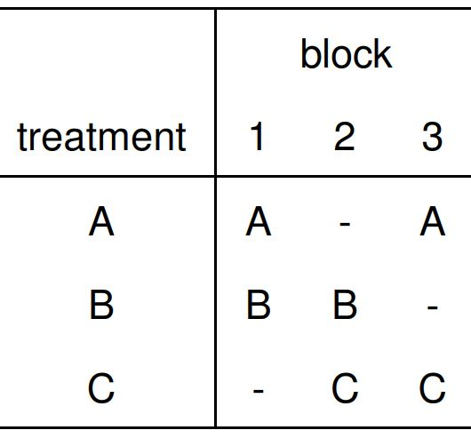
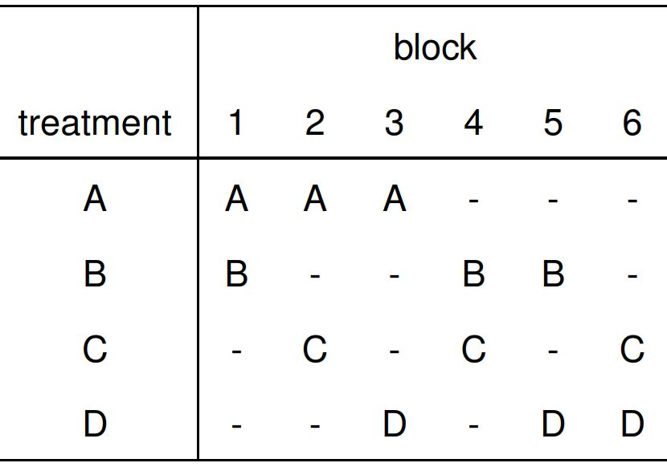
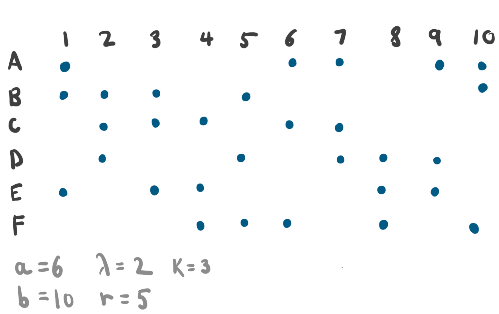
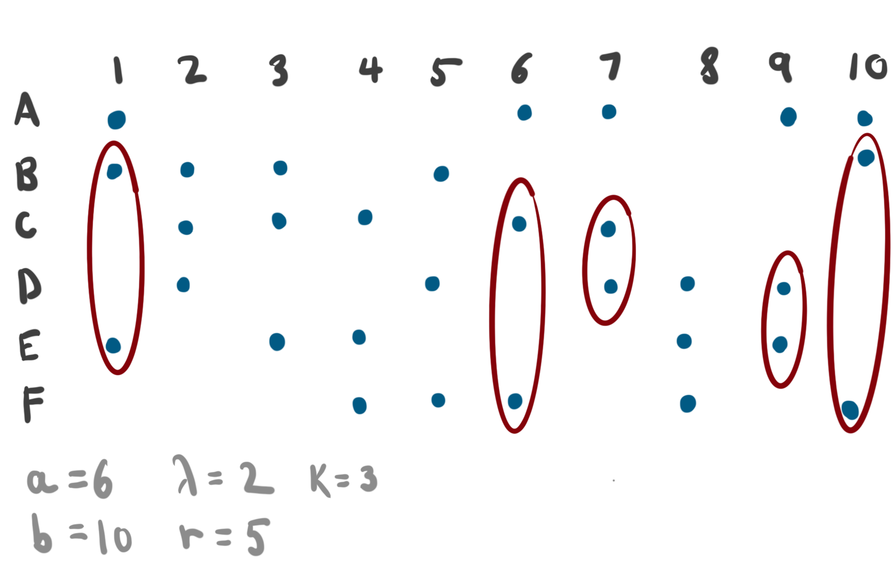
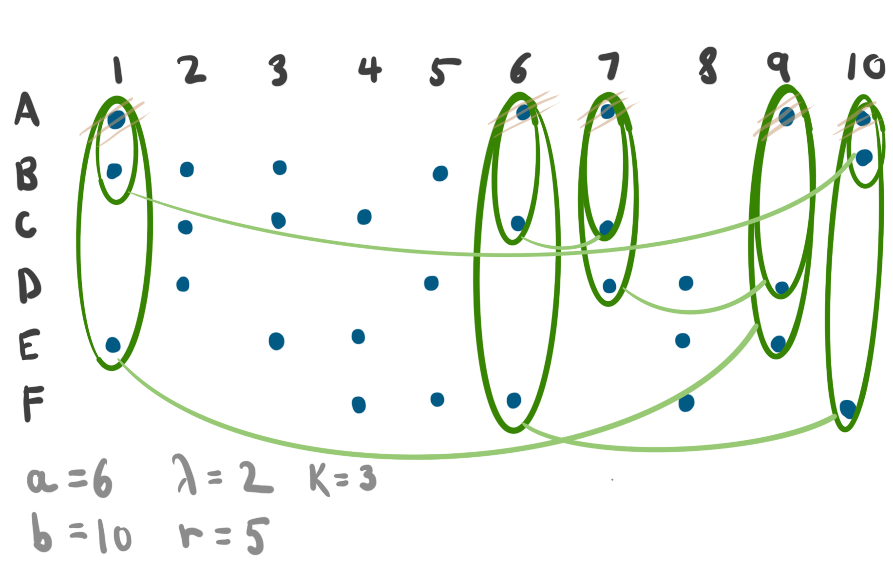
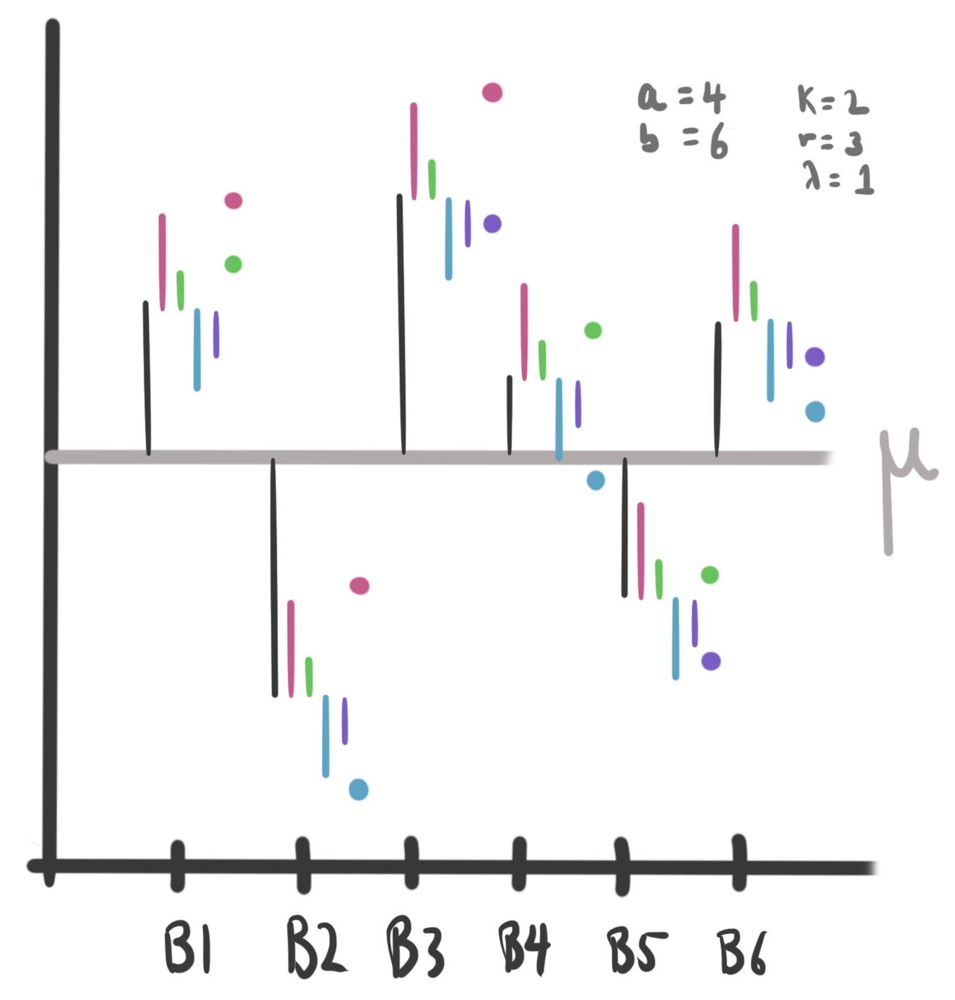
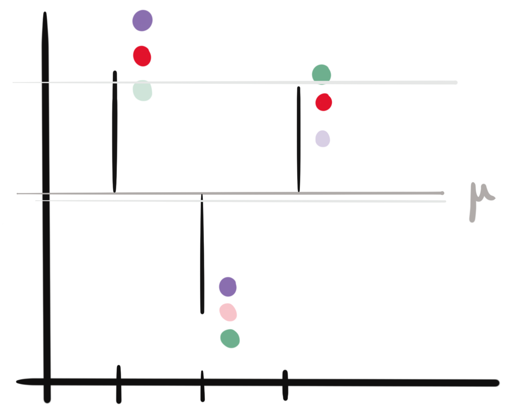

```{r setup, include=FALSE}
library(knitr)
opts_chunk$set(cache = FALSE, message = FALSE, warning = FALSE, echo = FALSE, fig.width = 6.5, fig.height = 3, fig.align = "center")
```

_Readings [4.4](https://www.wiley.com/en-us/Design+and+Analysis+of+Experiments%2C+10th+Edition-p-9781119492443#content-section), [Rmarkdown](https://github.com/krisrs1128/stat424_f21/blob/main/_posts/2021-08-16-week6-1/week6-1.Rmd)_

1. Randomized Complete Block Designs are good when you can run each treatment in
each block. What should we do if we have an upper limit on the number of samples
we can obtain for each block? For example,
  * The amount of material per block gets exhausted after 3 samples are
  prepared,
and we want to study 4 treatments 
  * We’re interested in three shoe sole types
  
2. We’ll have to settle on an Incomplete Block Design: not all treatments appear
in each block. We should assign treatments randomly. We will call a design
balanced if any pair of treatments appears together in a block the same number
of times.

```{r, fig.show = "hold", out.width = 200, fig.cap = "An example BIBD with 3 treatments total and 2 treatments run per each block."}

```

```{r, fig.show = "hold", out.width = 250, fig.cap = "An example BIBD with 4 treatments total and 2 treatments run per each block."}

```

3. Some helpful notation,
    * $a$: Number of treatment levels
    * $b$: Number of blocks
    * $k$: Number of treatments per block
    * $r$: Number of blocks per treatment
    * $\lambda$: Number of appearances for each level pair
  
```{r, fig.cap = "Circles mark which treatments are run in which blocks. We need to ensure balance across this diagram.", out.width = 500}

```
  
4. An identity that relates these variables is $\lambda (a - 1) = r(k - 1)$. We
can derive it by counting the number of samples that occur in blocks containing
treatment A, excluding the samples given treatment A.

```{r, fig.cap = "A way of counting samples that leads to the right hand side of the identity in item (4).", out.width = 500}

```

```{r, fig.cap = "A way of counting samples that leads to the left hand side of the identity in item (4).", out.width = 500}

```
  
### Hypothesis Testing

5. The model is the same as in the RCBD,
$$
y_{ij} = \mu + \tau_i + \beta_j + \epsilon_{ij}
$$
  where $\epsilon_{ij} \sim \mathcal{N}\left(0, \sigma^2\right)$ independently and
$\sum_{i} \tau_i= \sum_{j} \beta_{j}=0$. The difference is that we don’t observe
$y_{ij}$ for all combinations of blocks and treatments.

```{r, fig.cap = "Each column is a single block, colors are treatments. We choose only a subset of treatments within each block.", out.width = 400}

```

6. To test the hypothesis,
\begin{aligned}
H_0 &: \tau_1 = \dots = \tau_a = 0 \\
H_{1} &: \tau_{i} \neq 0 \text{ for at least one } i
\end{aligned}
  we can use a decomposition,
$$
SS_{\text{Total}} = SS_{\text{Treatments}\left(adjusted\right)} + SS_{\text{Block}} + SS_{E}
$$

7. The $SS_{\text{Total}}$ and $SS_{\text{Block}}$ terms are familiar, except
they are only summed over terms that are observed,
\begin{align}
SS_{\text{Total}} &= \sum_{i, j} \left(y_{ij} - \bar{y}_{\cdot\cdot}\right)^2 \\
SS_{\text{Block}} &= k \sum_{j} \left(\bar{y}_{\cdot j} - \bar{y}_{\cdot\cdot}\right)^2
\end{align}
8. But $SS_{\text{Treatments}}$ is not the expression you might guess at first.
The reason is each treatment only appears in a subset of blocks, which might
bias conclusions. An adjusted expression corrects for this bias,
    \begin{align*}
    SS_{\text{Treatments }(adjusted )}=\frac{k}{\lambda a} \sum_{i=1}^{a}\left(\bar{y}_{i}-\frac{1}{k} \sum_{j \in B(j)} \bar{y}_{\cdot j}\right)^2
    \end{align*}
    where $B\left(j\right)$ indexes the blocks within which treatment $i$ was administered.

```{r, fig.cap = "The transparent points are not actually observed. Ignoring this fact might lead to incorrect treatment estimates (treatments in the 'high' blocks might be incorrectly be thought to be larger in general).", out.width = 300}

```


9. $SS_E$ is obtained through subtraction, and turns out to have $N - a - b + 1$
degrees of freedom. Therefore,
\begin{aligned}
\frac{M S_{\text {Treatment }(\text { adjusted })}}{M S_{E}} &:=\frac{\frac{1}{a-1} S S_{\text {Treatment }(\text { adjusted })}}{\frac{1}{N-a-b+1} S S_{E}} \\
& \sim F(a-1, N-a-b+1)
\end{aligned}
  which can be used as the basis for a hypothesis test.

### Code Example

10. Before analyzing a BIBD experiment, it's worth knowing how to construct a
design given experimental constraints. Consider the following questions,
    * Suppose we have $a$ treatments and only $k$ can be applied per block. How
      many blocks would we need to collect before we could have a balanced design?
    * Once we know how many blocks we need in an experiment, how can we find a
      specific configuration of treatments to run in each block?
  
    The functions `BIBsize` and `find.BIB` answer these two questions. In the code
    below, we imagine having 5 treatments of interest, but can only run 3 in each
    block. The result of `BIBsize` is used to choose a specific design in
    `find.BIB`. Each row is a block, and the columns give the three treatments to
    run for each block.
  
```{r}
opts_chunk$set(echo = TRUE)
```

```{r}
library(crossdes)
library(daewr)
BIBsize(t = 5, k = 3) # we should use 10 blocks
find.BIB(trt = 5, k = 3, b = 10)
```

11. Next, we'll analyze a BIBD experiment. We download the `catalyst`
experiment, which studied the effect of different catalysts on chemical reaction
time.

```{r}
library(readr)
library(dplyr)
catalyst <- read_table2("https://uwmadison.box.com/shared/static/2tfwo6oohyffw0x299105rj54iabkw4u.txt") %>%
  mutate_at(vars(-Time), as.factor) # use as.factor on all but the Time column
```

12. To get a sense of the data, we'll make some plots of reaction time, both
against batch ID and catalyst type. Note that we only run three catalysts per
batch. There seem to be definitive batch-to-batch differences, but it's unclear
whether any of these catalysts are really any different from the others.

```{r}
library(ggbeeswarm)
ggplot(catalyst) +
  geom_beeswarm(aes(x = Batch, y = Time, col = Catalyst)) +
  scale_color_brewer(palette = "Set2")

```

13. To estimate the effects for each catalyst, we can use `lm`. The associated ANOVA
gives evidence against the null that the catalysts are equal, and the
corresponding confidence intervals suggests that catalyst 4 has a longer
reaction time than would be believable under the null. This is a nice situation
in which something that wasn't obvious visually becomes more clear when we
apply a principled testing procedure. Compare the ANOVA table with Table 4.25.

```{r}
fit <- lm(Time ~ ., data = catalyst)
aov_table <- aov(fit)
summary(aov_table) # only the unadjusted block mean square
```

14.  We can also compute contrasts in the way that we're used to. Here, we're
studying two hypotheses related to catalyst 4 (do it and catalyst 1 have larger
reaction times than the others? is catalyst 4 larger than catalyst 3?).

```{r}
library(gmodels)
contrasts <- matrix(
  c(1, -1, -1, 1,
    0, 0, 1, -1),
  nrow = 2, byrow=TRUE
)

fit.contrast(aov(fit), "Catalyst", contrasts)
```

15.  We can also control for multiple comparisons, but we need to use a
different function, since our usual `PostHocTest` isn't implemented to cover the
case of incomplete block designs. Instead, we can use the `lsmeans` function.
Unsurprisingly, the most significant tests seem to be highlighting the
discrepancy between catalyst 4 and the others.

```{r}
library(lsmeans)
lsmeans(fit, pairwise ~ Catalyst, adjust = "Tukey") # tukey's test
```