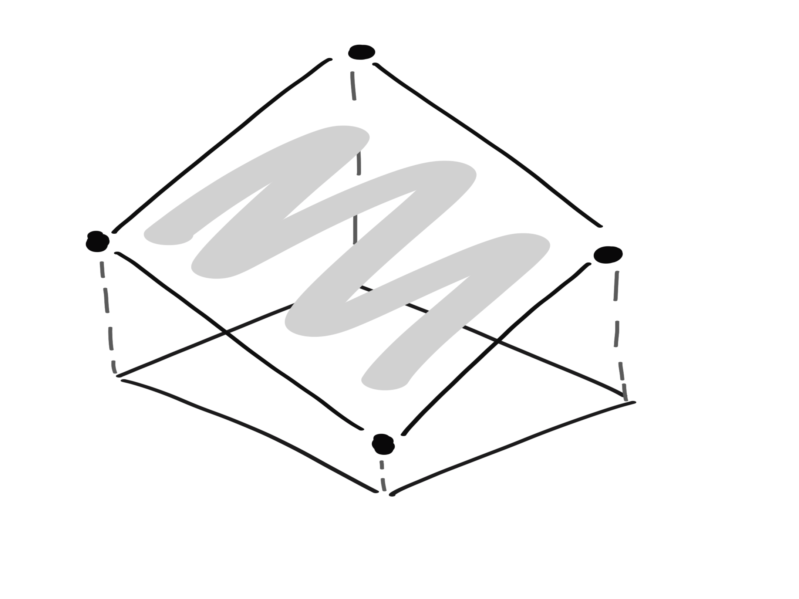
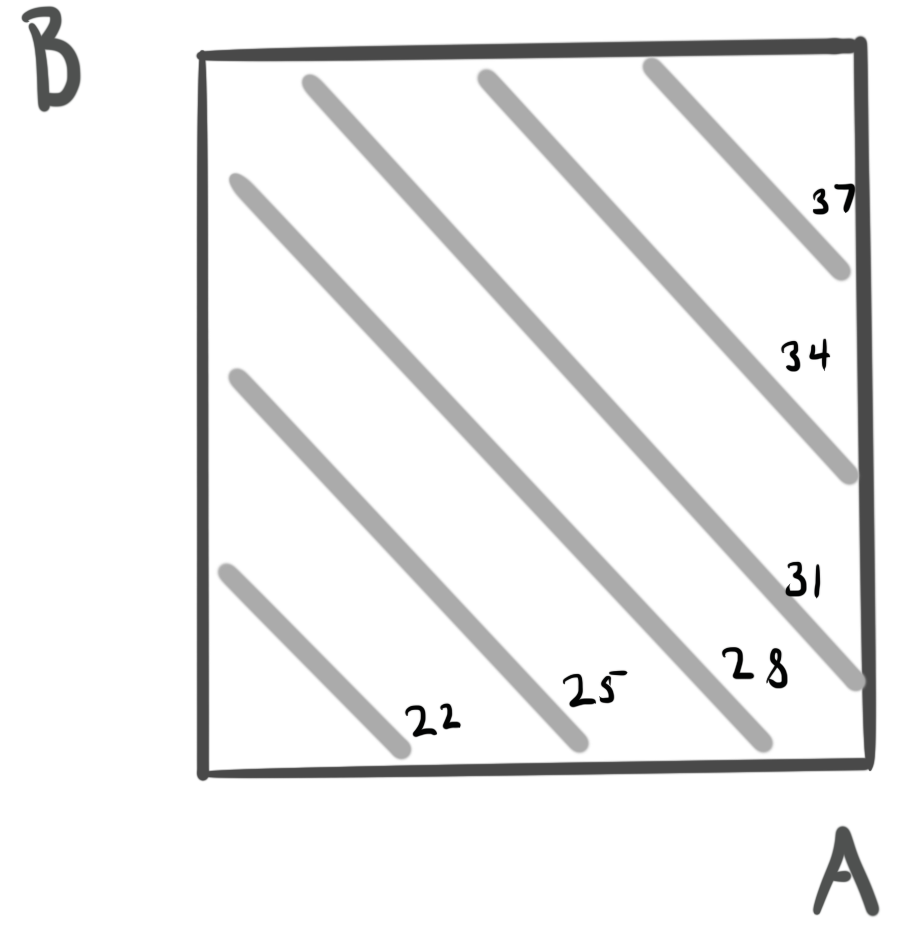
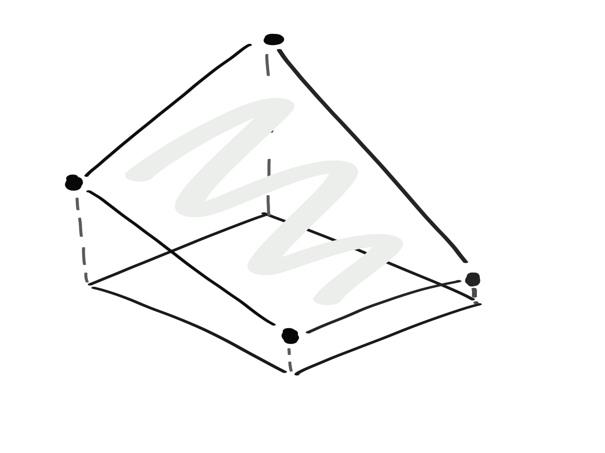
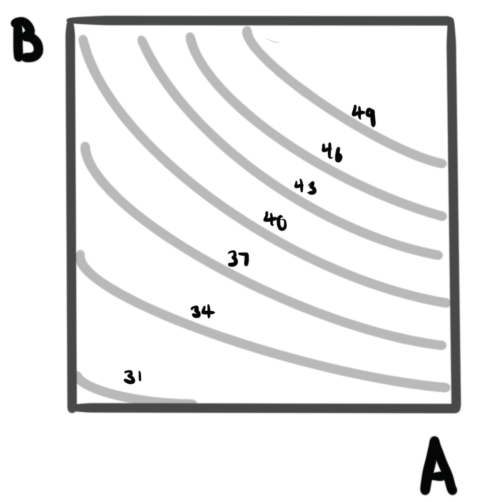

```{r setup, include=FALSE}
library(knitr)
opts_chunk$set(cache = FALSE, message = FALSE, warning = FALSE, echo = FALSE, fig.align = "center", out.width = 400)
```

_Readings [5.1 - 5.2](https://www.wiley.com/en-us/Design+and+Analysis+of+Experiments%2C+10th+Edition-p-9781119492443#content-section), [Rmarkdown](https://github.com/krisrs1128/stat424_f21/blob/main/_posts/2021-08-16-week6-2/week6-2.Rmd)_

1. To this point, we’ve only studied experiments with one factor of interest. How
should we design experiments when there are several factors, all of interest?

2. This is the most common situation we encounter in practice, and the remainder of
the course is going to be devoted to solutions to this problem, all based on the
idea of factorial designs.

3. For example, consider,
    * Battery life: An engineer wants to study how long a battery will last, as a
    function of temperature and material used in construction.
    * Bottling: The fill height of a bottling machine depends on percent
    carbonation, operating pressure, and assembly line speed, but the precise
    relationship is currently unknown.
  
### Visualizing Factorial Designs

4. When we have two factors and a continuous response, we can visualize the
relationship either in 3D, or from the top down.
     * If the factor has only two levels, the possible configurations are
     corners square (hypercube, in higher dimensions).
    * If it can vary continuously, we get a surface.
    
```{r, fig.cap = "A two factor experiment viewed in 3D."}

```

```{r, fig.cap = "A two factor experiment viewed from the top down."}

```
    
5. When we have more than two factors, we have to pick a subset of factors to
visualize at a time, and show multiple surfaces for each configuration of other
factors.

### Main and Interaction Effects

6. The main effect of a factor is the amount that the response changes when we
change its value by one unit. The main effect is defined as the average response
change, where the average is taken over values of all other factors

7. It’s possible that the change in response of one factor depends on the value
of other factors. In this case, we say there is an interaction between the
factor and the factors that cause changes in effect sizes.

```{r, fig.cap = "A two factor experiment with an interaction effect, viewed in 3D"}

```

```{r, fig.cap = "A two factor experiment with an interaction effect, viewed from the top down"}

```

8. We can encode an interaction through a regression equation
$$
y = \beta_0 + \beta_1 x_1 + \beta_2 x_2 + \beta_{12} x_{1} x_{2}
$$
    * When $\beta_{12}$ is nonzero, there is an interaction between $x_1$ and
    $x_2$.
    * In this case, the slopes of $x_1$ and $x_2$ are not fixed, and each depends
    on the value of the other variable.
