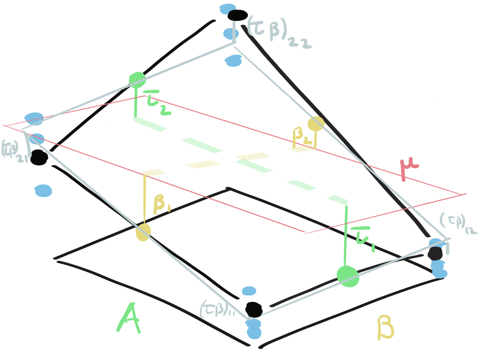

```{r setup, include=FALSE}
library(knitr)
opts_chunk$set(cache = FALSE, message = FALSE, warning = FALSE, echo = FALSE)
theme424 <- theme_minimal() + 
  theme(
    panel.grid.minor = element_blank(),
    panel.background = element_rect(fill = "#f7f7f7"),
    panel.border = element_rect(fill = NA, color = "#0c0c0c", size = 0.6),
    axis.text = element_text(size = 14),
    axis.title = element_text(size = 16),
    legend.position = "bottom"
  )
theme_set(theme424)
```

_Readings [5.3](https://www.wiley.com/en-us/Design+and+Analysis+of+Experiments%2C+10th+Edition-p-9781119492443#content-section), [Rmarkdown](https://github.com/krisrs1128/stat424_f21/blob/main/_posts/2021-08-16-week7-1/week7-1.Rmd)_

1. Recall that in a factorial design, we want to study the influences of
multiple experimental factors on some responses of interest. The simplest
situation is when there are two factors of interest, and the associated designs
are two-factor factorial designs.

2. We will assume a model of the form,
$$
y_{ijk} = \mu + \tau_i + \beta_j + \left(\tau\beta\right)_{ij} + \epsilon_{ij}
$$
  where $\epsilon_{ijk} \sim \mathcal{N}\left(0, \sigma^2\right)$ independently.
  For identifiability, we have to assume that the sums $\sum_{i} \tau_i =
  \sum_{j} \beta_{j}= \sum_{ij} \left(\tau\beta\right)_{ij}=0$. We’ll suppose
  $i$ ranges from $1, \dots, a$, $j$ ranges from $1, \dots, b$ and $k$ ranges
  from $1,\dots, n$.
  
2. What do the indices mean?
    * $i$ indexes levels of the first factor (temperature).
    * $j$ indexes levels of the second factor (material).
    * $k$ indexes multiple replicates at a particular factor combination $ij$
    (battery lifetimes, for fixed temperature $\times$ material combination)
  
3. What do the greek letters mean?
    * $\mu$: An intercept term, representing a global mean.
    * $\tau_i$: The effect of the $i^{th}$ level of factor 1 on the average response
    (effect of temperature setting $i$)
    * $\beta_{j}$: The effect of the $j^{th}$ level of factor 2 on the average
    response (effect of material $j$)
    * $\left(\tau\beta\right)_{ij}$:The interaction / synergy between the
    $i^{th}$ level of factor 1 and the $j^{th}$ level of factor 2. (e.g.
    long / short response times, depending on particular material and
    temperature settings)
    * $\epsilon_{ijk}$: The random variation we’d observe if we drew many samples at
    a fixed setting of the two factors.
      __Caution__: $\beta_j$ now indexes a treatment of interest. It is *not* just
      nuisance blocking variation.

```{r, fig.cap = "A graphical view of all the parameters in a factorial design.", preview = TRUE}

```
  
### Testing

4. Up until now, we’ve only asked whether one particular factor had an influence
on the response, as the levels were changed. Now, we care about each of the
factors, and each gets a hypothesis test.

  * (Hypothesis A) For the first factor, 
\begin{align}
H_0 &: \tau_1 = \dots = \tau_a = 0 \\
H_{1} &: \tau_{i} \neq 0 \text{ for at least one } i
\end{align}

  * (Hypothesis B) For the second factor,
\begin{align}
H_0 &: \beta_1 = \dots = \beta_{b} = 0 \\
H_{1} &: \beta_{j} \neq 0 \text{ for at least one } j
\end{align}

  * (Hypothesis AB) Are there interaction effects?
\begin{align}
H_0: \left(\tau\beta\right)_{ij}= \dots = \left(\tau\beta\right)_{ij} = 0 \\
H_1: \left(\tau\beta\right)_{ij} &= 0 \text{ for at least one } ij \text{ combination}
\end{align}

5. For each of these hypothesis tests, we’re going to need a test statistic
that’s sensitive to departures from the null. We’re also going to need their
reference distributions.

6. Miraculously, we have the identity,
\begin{align*}
\sum_{i j k}\left(y_{i j k}-\bar{y}\right)^{2}=& b n \sum_{i}\left(\bar{y}_{i . .}-\bar{y}\right)^{2}+\\
& a n \sum_{j}\left(\bar{y}_{.j.} -\bar{y}\right)^{2}+\\
& n \sum_{i, j}\left(\bar{y}_{i j.}-\bar{y}_{i. .}+\bar{y}_{. j.}-\bar{y}\right)^{2}+\\
& \sum_{i, j, k}\left(y_{i j k}-\bar{y}_{i j.} .\right)^{2}
\end{align*}
  which we’ll denote $SS_{\text{Total}}=SS_{A}+SS_{B}+SS_{AB}+SS_{E}$.

7. The punchline is that if $SS_{A}$ is large, we have evidence against
hypothesis A, if $SS_{B}$ is large we have evidence against hypothesis B, and if
$SS_{AB}$ is large, we have evidence against hypothesis AB.

```{r, fig.show = "hold", out.width = "45%"}
include_graphics("https://uwmadison.box.com/shared/static/ner7fbntbrdatsi94lk8p7bz469vigcd.png")
include_graphics("https://uwmadison.box.com/shared/static/sf0qeddpcestas9t5c2ubo7rsyz9cnpk.png")
```

8. Dividing $SS$ terms by their degrees of freedom (d.f.) gives $MS_{A}, MS_{B},
MS_{AB}$, and $MS_{E}$. The d.f. are derived from the number of levels for each
factor, but a proof is beyond the scope of this course.

-----
| term | d.f.|
-----
| $SS_{A} | $a - 1$ |
| $SS_{B} | $b - 1$ |
| $SS_{AB} | $\left(a - 1\right)\left(b - 1\right)$ |
| $SS_{E} | $ab\left(n - 1\right)$ |
-----

9. We can define corresponding mean squares by dividing by the degrees of
freedom. For each hypothesis, we get a corresponding $F$-statistic.

```{r, fig.show = "hold", out.width = "45%"}
include_graphics("https://uwmadison.box.com/shared/static/2956oz2t0rows6bj3zprb0yssagp7fww.png")
include_graphics("https://uwmadison.box.com/shared/static/y1j6wo96ocp0cr2ourswaklsa6exl8ed.png")
```

### Code Example

10. We'll consider an experiment that studied the effect of material and
temperature on battery lifetimes. These are the two factors of interest, and
each is measured at 3 levels.

```{r}
options(echo = TRUE)
```


```{r}
library(readr)
library(dplyr)
battery <- read_table2("https://uwmadison.box.com/shared/static/vmxs2wcsdxkdjujp85nw5kvk83xz4gl9.txt") %>%
  mutate_at(vars(-Life), as.factor)

battery
```

11. Before testing for effects, we can plot the influence of each factor. The
code below uses `facet_wrap` to split the plot across the three material types.
There seems to be a clear temperature effect, though the effects are not exactly
the same across material. This suggests that an interaction is present, though
we will need a test to quantify the strength of this pattern.

```{r, fig.height = 3, fig.width = 5}
library(ggplot2)
ggplot(battery) +
  geom_point(aes(Temperature, Life)) +
  facet_wrap(~ Material)
```

12. We can fit the two factor model using `lm`. We use the syntax `Material *
Temperature` to fit all main effects and interactions involving those variables;
it is shorthand for the more explicit notation `Material + Temperature +
Material : Temperature` (here, the `:` denotes an interaction). The `Material`
and `Temperature` rows of the ANOVA table give main effects, the
`Material:Temperature` row gives the interaction effect, and the `Residuals` row
corresponds to the $SS_{E}$ and $MS_{E}$ terms.

```{r}
fit <- lm(Life ~ Material * Temperature, data = battery)
summary(aov(fit))
```

13. Based on the $p$-values, we conclude that there is a very strong temperature
effect, a strong material effect, and a noticeable (though slight) interaction.
We can in fact develop more granular interpretations by looking at individual
coefficients in the fitted model. The runs from the first material and lowest
temperature are used as a reference point and absorbed into the intercept --
everything else is viewed as the expected deviation from that reference. For
example, it seems that, on average, the temperature 70 and 125 configurations
are both about 80 life-units shorter than runs at temperature 15. The
significant interaction between material 3 and temperature 70 suggests that this
combination lives about 80 units longer than we would expect if no interaction
were present.

```{r}
summary(fit)
```
