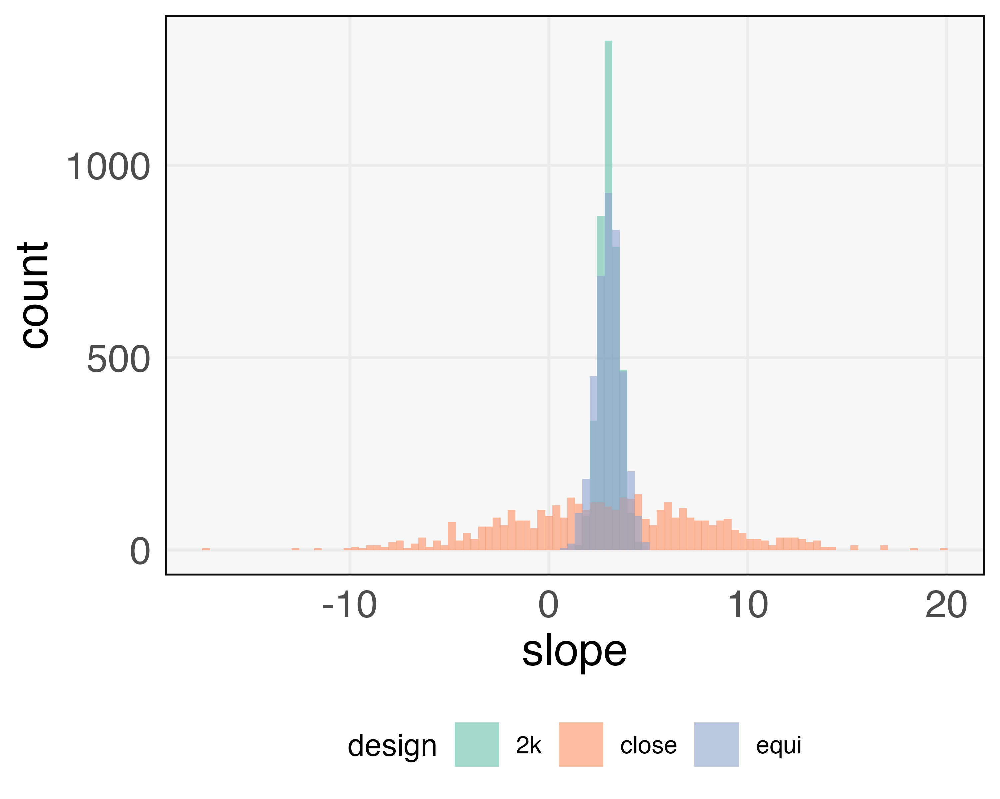

```{r setup, include=FALSE}
library(knitr)
library(ggplot2)
opts_chunk$set(echo = FALSE, message = FALSE, warning = FALSE, cache = FALSE, dpi = 200, fig.width = 4.5, fig.height = 2.8, dev = 'svg', dev.args = list(bg = "transparent"), fig.show = "hold", fig.align = "center")
theme424 <- theme_minimal() + 
  theme(
    panel.grid.minor = element_blank(),
    panel.background = element_rect(fill = "#f7f7f7"),
    panel.border = element_rect(fill = NA, color = "#0c0c0c", size = 0.6),
    axis.text = element_text(size = 14),
    axis.title = element_text(size = 16),
    legend.position = "bottom"
  )
theme_set(theme424)
```

# $2^{K}$ Designs and Regression

```{r, out.width = 400, fig.align = "left"}
include_graphics("https://uwmadison.box.com/shared/static/rfdz734pv6rxolgwz5fx215qb41qm0k6.png")
```

### Statistical Experimental Design

.large[Kris Sankaran | UW Madison | November 9, 2021]

---

### Announcements

* HW5 Problem 6.29 should only be (a - d), not (a - e).
* Midterm 2 is in two weeks

---

### Today

* Book Sections: 6.7 - 6.8
* Online Notes: Week 10 [1], [2], and [3]

---

### Motivation

* We have been using the coefficients from `lm` to estimate factor effects. Why
does this work? There are important connections with linear regression.
* There is a rich theory of optimality for linear regression. Can we adapt that
to understanding $2^K$ designs?

---

### Proof Sketch

* `lm` fits equations of the form $y = X\beta + \epsilon$. We'll study exactly the
form of $X$ and $y$ that we pass into `lm`.
* We'll study properties of the matrix $X$, which allow us to compute the
regression estimate $\hat{\beta}$ in closed form
* We'll relate the closed form estimate of $\hat{\beta}$ to our original factor effect estimates

---

### Coding Factors

.pull-left[
* We always passed `lm` a coded version of the raw factor values
* Coding converts the raw factor values into the range $\left[-1, 1\right]$.
* If the low and high temperatures of an experiment were 60 and 80, then $60 \to -1$ and $80 \to 1$.
* Any value within the range can be coded,
  - $65 \to 0.25$ because $\frac{65 - 60}{80 - 60} = 0.25$
]

.pull-right[
```{r}
include_graphics("https://uwmadison.box.com/shared/static/giacopxkfj5jhuucepards9fv0cqvbmc.png")
```
]

---

### Coding Factors

* We can use coding to convert a table of +, - into a numeric matrix.
* The notation $(1), a, b, ...$ refers to the measured response at those corners
of the cube
* We've added an extra intercept column to $X$

| A | B | C | AB | label |
|---|---| --- | --- | --- |
| - | - | - | + | (1) |
| + | - | - | - | a |
| - | + | - | - | b |
| - | - | + | + | c |
| + | + | - | + | ab |
| + | - | + | - | ac |
| - | + | + | - |  bc |
| + | + | + | + | abc |
]

---

### Coding Factors

* We can use coding to convert a table of +, - into a numeric matrix.
* The notation $(1), a, b, ...$ refers to the measured response at those corners
of the cube
* We've added an extra intercept column to $X$

<div class="math">
\[
\begin{align}
X = \begin{pmatrix}
1 & -1 & -1 & - 1 & 1 \\
1 & 1 & -1 & -1 & -1 \\
1 & -1 & 1 & -1 & -1 \\
1 & -1 & -1 & 1 & 1 \\
1 & 1 & 1 & -1 & 1 \\
1 & 1 & -1 & 1 & -1 \\
1 & -1 & 1 & 1 & -1 \\
1 & 1 & 1 & 1 & 1
\end{pmatrix}
&&
y = \begin{pmatrix}
(1) \\
a \\
b \\
c \\
ab \\
ac \\
bc \\
abc
\end{pmatrix}
\end{align}
\]
</div>

---

### Properties of $X$

* $X$ is a square matrix, with $2^{K}$ rows and columns
* Its columns are orthogonal to one another
* The sum of squares of any column is $2^K$
* These three facts imply $X^T X = 2^{K}I_{2^{K}}$.

```{r, out.width = 500}
include_graphics("https://uwmadison.box.com/shared/static/8euuywv5ay4x7przznhsxdo269865h2a.png")
```

---

### Regression Closed Form

Linear models assume the response is a linear function of the predictors $X$, with some additional noise,

<div class="math">
\[
\begin{align*}
y = X \beta + \epsilon
\end{align*}
\]
</div>

Least squares fits $\hat{\beta}$ by minimizing $\|y - X\beta\|_{2}^{2}$. The
solution has a closed form,

<div class="math">
\[
\begin{align*}
\hat{\beta} &= \left(X^T X\right)^{-1} X^T y
\end{align*}
\]
</div>

We will take this fact for granted; it is proved in most linear regression
courses.

---

### Substituting $X$ matrix

The $X$ matrix in $2^{K}$ designs has a special form, so we can simplify the
formula for $\hat{\beta}$.

<div class="math">
\[
\begin{align*}
\hat{\beta} &= \left(2^{K}I_{2^{K}}\right)^{-1}X^T y \\
&= \frac{1}{2^{K}}X^{T}y.
\end{align*}
\]
</div>

---

### $X^T y$ and contrasts

The matrix $X^T y$ are exactly our contrasts,

<div class="math">
\[
\begin{align*}
X^{T}y &= \begin{pmatrix}
1 &  1 &  1 &  1 & 1 & 1 &  1 & 1 \\
-1 & 1 & -1 & -1 & 1 & 1 & -1 & 1 \\
-1 & -1 & 1 & -1 & 1 & -1 & 1 & 1 \\
\vdots & & & & & & & \vdots
\end{pmatrix}
\begin{pmatrix}
\left(1\right) \\
a \\
b \\
c \\
\vdots 
\end{pmatrix}
\end{align*}
\]
</div>

For example,
<div class="math">
\[
\begin{align*}
A = \frac{1}{2^{K - 1}}\left[-(1) + a - b -c + ab + ac - bc + abc\right]
\end{align*}
\]
</div>

The only difference between $\hat{\beta}$ and the effect estimates is that
$\hat{\beta}$ divides by $2^{K}$ while the effect estimates divide by $2^{K -
1}$.

---

### Regression and Optimality

This connection to regression allows us to make statements about the optimality of $2^{K}$ designs. To declare a statistical procedure optimal, we need to specify the,

* Experimental Setting: We have $K$ factors and a fixed budget of $n$ samples.
* Candidates Procedures: We can take samples at any combination of settings of the $K$ factors.
* Evaluation Criteria: We want to estimate the effects as well as possible.

We won't prove optimality results, but will include a simulation experiment to
build intuition about how to interpret these results.

---

### Three Candidates for $K = 1, n = 4$

* The $2^{K}$ design places all samples at the extreme levels of the factors (middle)
* Instead, we might have placed points evenly along a grid (left) or less extreme values of the factors (right).

```{r, out.width = 250, fig.cap="Three candidate designs explored in our $K = 1$ simulation."}
include_graphics("https://uwmadison.box.com/shared/static/zm5ork632pktbbryzvs4ex6fbvd78z72.png")
include_graphics("https://uwmadison.box.com/shared/static/48czl1on1krut0gquz5arqdb5a81ft40.png")
include_graphics("https://uwmadison.box.com/shared/static/0s7m67r9k447irxr8jdzmta8h0ea2seg.png")
```

---

### Simulation

.pull-left[
* The red line is the true response
* We use each of the three designs (separate panels)
* We observe noisy data around the true response (black dots)
* Estimated effects are the [moving lines](https://drive.google.com/file/d/1v-eZJ6ssNHkqIDaG-66cinUI-gGdpP8d/view?usp=sharing)
]

.pull-right[
```{r}

```
]

---

### Interpretation

* The design with points close to one another leads to highly variable estimates
* The $2^{K}$ design is optimal in two senses,
  - The band of predictions is always close to the red line
  - The estimated slope is more narrowly centered around the truth

.pull-left[
```{r, out.width = 320}

```
]
.pull-right[
```{r, out.width = 300}

```
]

---

### Three Notions of Optimality

In general, $2^{K}$ designs satisfy three notions of optimality,

* $D$-optimality :
$\left|\text{Cov}\left(\hat{\beta}\right)\right|$ is minimized. This happens when the width of the histogram of $\hat{\beta}$ is minimized.
* $G$-optimalty: $\max_{x} \text{Var}\left(\hat{y}\left(x\right)\right)$ is minimized. This
happens when the maximum vertical spread of the prediction band is minimized.
* $V$-optimality: $\int_{\left[-1, 1\right]^{K}}. \text{Var}\left(\hat{y}\left(x\right)\right)dx$ is minimized. This happens when the area of the prediction band is minimized

---

### Caveat: Nonlinearity

* The simulation above relied strongly on the linearity of the relationship
between the factor and outcome.
* If there is any nonlinearity, the $2^{K}$ design will be unable to detect it
* For this reason, it's common to add "center points"

```{r, fig.show = "hold", out.width = "48%"}
include_graphics("https://uwmadison.box.com/shared/static/6s1qw3mjzok5zrm7l384undexkb2ga2u.png")
include_graphics("https://uwmadison.box.com/shared/static/z0rpppgsnte77f3vsl5dsrbvtyrtqne0.png")
```

---

### Caveat: Nonlinearity

* The simulation above relied strongly on the linearity of the relationship
between the factor and outcome.
* If there is any nonlinearity, the $2^{K}$ design will be unable to detect it
* For this reason, it's common to add "center points"

```{r, fig.show = "hold", out.width = "48%"}
include_graphics("https://uwmadison.box.com/shared/static/53o5ytugsbmpgvxcwmfy6053dfvrh3kv.png")
include_graphics("https://uwmadison.box.com/shared/static/gz504o59rs4212x3v8mip87wbglq4xmw.png")
```

---

### Code Example

```{r}
opts_chunk$set(echo = TRUE)
```

We will use this code example to illustrate steps in the derivation above. We
will again consider the drill dataset and first fit a linear model on the coded
variables.

```{r, layout="l-body-outset"}
library(readr)
library(dplyr)
code <- function(x) ifelse(x == '-', -1, 1)
drill <- read_csv("https://uwmadison.box.com/shared/static/7l8bpcu36a12a8c0chlh4id0qezdnnoe.csv") %>%
  mutate_at(vars(A:D), code)
fit <- lm(rate ~ A * B * C * D, drill)
```

---

### Matrix $X$

We can extract the design matrix used by `lm` using the function `model.matrix`.

```{r}
X <- model.matrix(fit)
dim(X)
X
```

---

### $X^T X$

Next, we confirm that $X^ T X = 2^{K}I_{K}$.

```{r}
t(X) %*% X
```

---

### Manual Effect Estimation

The step below computes the effect of factor A using three different approaches,

.pull-left[
* The original definition, which averages the difference between settings that are the same except for whether A is on or off
* The formula $\frac{1}{2^{K - 1}} X^T y$ discussed above
* The coefficient $\hat{\beta}$ of the linear regression
]

.pull-right[
```{r}
mean(drill$rate[drill$A == 1] - drill$rate[drill$A == -1])
(((1 / 8) * t(X) %*% drill$rate))["A", ]
2 * coef(fit)["A"]
```
]

---

### Exercise

This exercise does not follow a textbook example. Instead, we will design a
concept map of factorial designs together.

(1) Initialize your team's map using the seed terms on the next page.

(2) Motivated by the extension phrases in the next page, draw new links and
nodes in your concept map.

(3) Upload a picture / screenshot of your final concept map to this [piazza post](https://piazza.com/class/ksf28gqo39x382?cid=75).

In your post, highlight one part of the map that you feel you understand better
now and another that still seems difficult to fill in.

---

Seed Terms: General factorial design, $2^K$ design, $2^2$ design, unreplicated
design, two-way interaction, `lm`, `A * B * C * D`, Daniel Plot, `2 * coef(fit)`, interaction term, coding, regression equation, $F$-statistic, design
projection, center points

Extension Phrases: is motivated by, is implemented by, is useful for, differs from other designs because, appears in problems like, is defined as, can be checked by, is a special case of, ...
