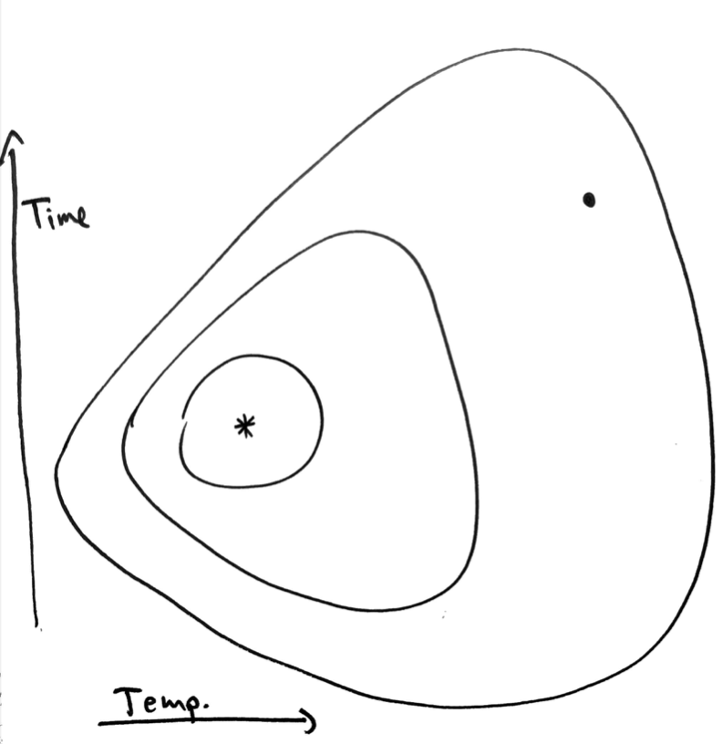
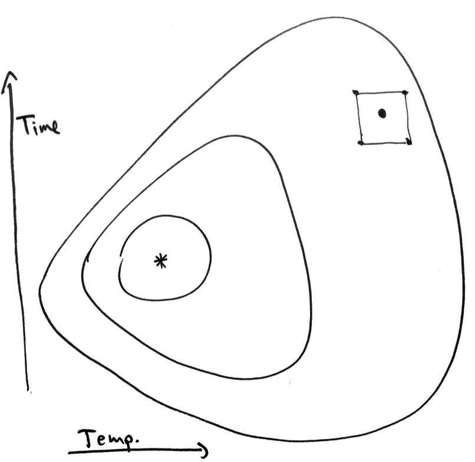
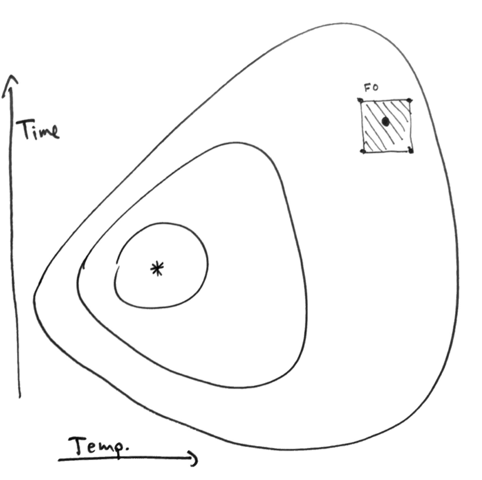
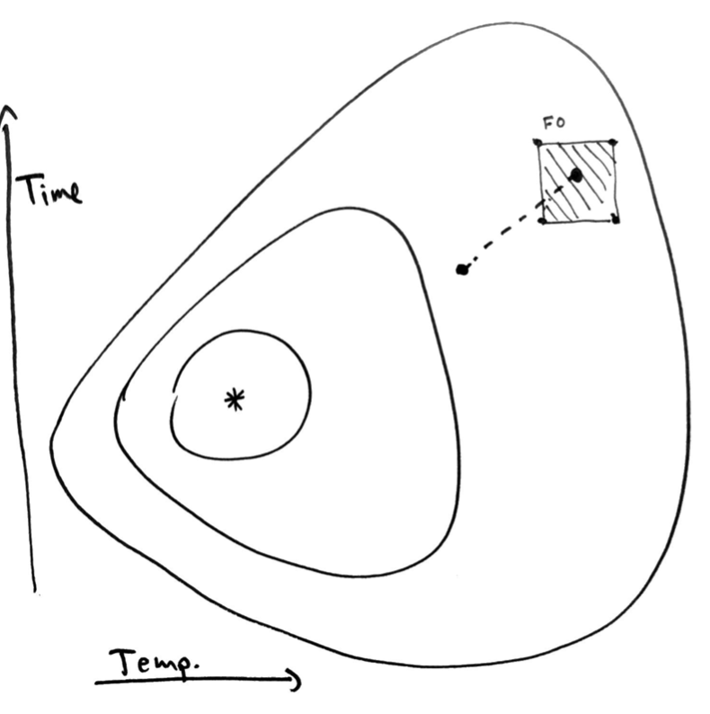
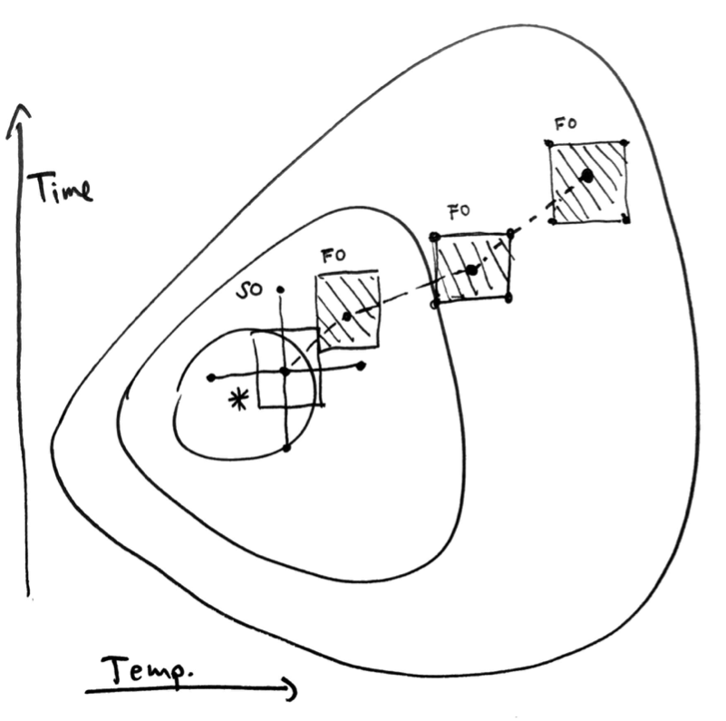
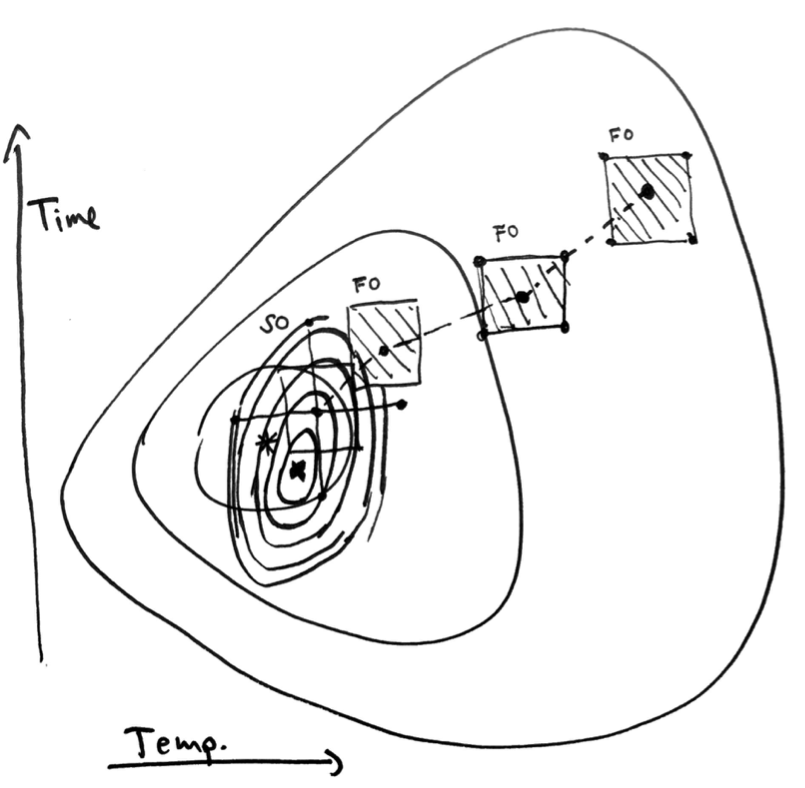

```{r setup, echo=FALSE}
library(knitr)
library(ggplot2)
opts_chunk$set(echo = FALSE, message = FALSE, warning = FALSE, cache = TRUE, dpi = 200, fig.width = 6, fig.height = 2.8, dev = 'svg', dev.args = list(bg = "transparent"), fig.align = "center")
theme424 <- theme_minimal() + 
  theme(
    panel.grid.minor = element_blank(),
    panel.background = element_rect(fill = "#f7f7f7"),
    panel.border = element_rect(fill = NA, color = "#0c0c0c", size = 0.6),
    axis.text = element_text(size = 14),
    axis.title = element_text(size = 16),
    legend.position = "bottom"
  )
theme_set(theme424)
```

# Response Surfaces II

```{r, out.width = 400, fig.align = "left"}
include_graphics("https://uwmadison.box.com/shared/static/uubzanl5c273c45mxazy0d06r7r0uz52.png")
```
### Statistical Experimental Design

.large[Kris Sankaran | UW Madison | December 2, 2021]

---

### Today

* Book Sections: 11.3, 11.4.1 - 11.4.2
* Online Notes: Week 11 [3] and [4]

---

### Review

> I do not understand the second order model- if we are running a sequence of
> experiments, isn't there a model implied by each experiment?

* There _is_ a model implied by each experiment
* "Second" refers to the complexity of the model (linear vs. quadratic)
* The sequence includes a series of first order models followed by a second order one

---

```{r, out.width = 500}

```
---
```{r, out.width = 500}

```
---
```{r, out.width = 500}

```
---
```{r, out.width = 500}

```
---
```{r, out.width = 500}

```
---
```{r, out.width = 500}

```
---


### Motivation

* **Multiple Responses**: Usually, we need to balance several competing
objectives.
  - Process efficiency vs. cost, material strength vs. production speed, ...
  - How can response surfaces be adapted to this multi-response setup?
* **Designs**: We have a choice of designs during both the first and second
order phases
  - Which designs are most commonly used, and why?

---

### Comparing Contours

The most straightforward approach is to treat each response separately.
* We can compare contours to find acceptable configurations
* Below: Response surfaces for yield, viscosity, and molecular weight

```{r, fig.width = 8, fig.height = 3, out.width = 920, dpi = 200}
library(readr)
library(dplyr)
library(rsm)

chem <- read_csv("https://uwmadison.box.com/shared/static/nbaj1m8j7tuaqmznjlrsgbzyhp9k61i8.csv")
chem_coded <- coded.data(chem, time_coded ~ (time - 35) / 5, temp_coded ~ (temp - 155) / 5)
fits <- list(
  "yield" = rsm(yield ~ SO(temp_coded, time_coded), data = chem_coded),
  "viscosity" = rsm(viscosity ~ SO(temp_coded, time_coded), data = chem_coded),
  "molecular_weight" = rsm(molecular_weight ~ SO(temp_coded, time_coded), data = chem_coded)
)
par(mfrow = c(1, 3))
contour(fits[[1]], ~ time_coded + temp_coded, image = TRUE, asp = 1)
contour(fits[[2]], ~ time_coded + temp_coded, image = TRUE, asp = 1)
contour(fits[[3]], ~ time_coded + temp_coded, image = TRUE, asp = 1)
par(mfrow = c(1, 1))
```

---

### Constrained Optimization

* Define acceptable ranges for responses  $y_{2}\left(x\right), \dots, y_{R}\left(x\right)$ that are important, but not our main focus.
* Optimize the response $y_{1}\left(x\right)$ that’s our main focus.

```{r, fig.width = 8, fig.height = 3, out.width = 920, dpi = 200}
par(mfrow = c(1, 3))
contour(fits[[1]], ~ time_coded + temp_coded, image = TRUE, asp = 1)
contour(fits[[2]], ~ time_coded + temp_coded, image = TRUE, asp = 1)
contour(fits[[3]], ~ time_coded + temp_coded, image = TRUE, asp = 1)
par(mfrow = c(1, 1))
```

---

### Constrained Optimization

Formally, this seeks the $x_{\ast}$ that solves,
\begin{align*}
\underset{x}{\text{maximize}}\space &y_{1}\left(x\right) \\
\text{subject to }\space &\left(y_{2}\left(x\right), \dots, y_{R}\left(x\right)\right) \in \mathcal{C}
\end{align*}
where $\mathcal{C}$ is a preset constraint region.
```{r, fig.width = 8, fig.height = 3, out.width = 800, dpi = 200}
par(mfrow = c(1, 3))
contour(fits[[1]], ~ time_coded + temp_coded, image = TRUE, asp = 1)
contour(fits[[2]], ~ time_coded + temp_coded, image = TRUE, asp = 1)
contour(fits[[3]], ~ time_coded + temp_coded, image = TRUE, asp = 1)
par(mfrow = c(1, 1))
```

---

### Desirability Functions

* A difficulty with the constrained optimization approach is that it forces us
to prioritize one response over the rest
* We can instead optimize the product,
\begin{align*}
\underset{x}{\text{maximize}} \space \left[\prod_{r = 1}^{R} d_{r}\left(y_{r}\left(x\right)\right)\right]^{\frac{1}{R}}
\end{align*}
for some _desirability_ functions $d_r \in \left[0, 1\right]$ that take high
values when $y_r$ is in a desirable region.
* The product will only be high when all the $y_r$ are in desirable regions

---

### Desirability Functions

.pull-left[
\begin{align*}
\underset{x}{\text{maximize}} \space \left[\prod_{r = 1}^{R} d_{r}\left(y_{r}\left(x\right)\right)\right]^{\frac{1}{R}}
\end{align*}
]

---

### Desirability Functions

Example functions $d_r$, 

```{r, fig.height = 3, fig.width = 6, out.width = 800}
library(stringr)
library(desirability)
library(tidyr)
library(dplyr)

x_grid <- seq(-1, 1, .01)
example_funs <- data.frame(
  x = x_grid,
  d_max_0.5 = predict(dMax(0, 1, 0.5),  x_grid),
  d_max_1 = predict(dMax(0, 1, 1),  x_grid),
  d_max_2 = predict(dMax(0, 1, 2), x_grid),
  d_min_0.5 = predict(dMin(-1, 0, 0.5), x_grid),
  d_min_1 = predict(dMin(-1, 0, 1), x_grid),
  d_min_2 = predict(dMin(-1, 0, 2), x_grid),
  d_target_0.5 = predict(dTarget(-1, 0, 1, 0.5, 0.5), x_grid),
  d_target_1 = predict(dTarget(-1, 0, 1), x_grid),
  d_target_2 = predict(dTarget(-1, 0, 1, 2, 2), x_grid)
) %>%
  pivot_longer(-x, names_to="fun") %>%
  mutate(
    type = str_replace(fun, "[\\.0-9]+", ""),
    scale = str_extract(fun, "[\\.0-9]+")
  )

ggplot(example_funs) +
  geom_line(aes(x, value, col = scale)) +
  scale_color_brewer(palette = "Set2") +
  facet_grid(.~ type)
```

---

### Discussion

* What is an example of a situation where you might want to optimize several
competing objectives?
* Sketch either,
  - Hypothetical contours and constraint sets, or
  - Example desirability functions,
  that would help select an optimal configuration.
* Explain the choices made in your sketch. E.g., why are the constraints where you set them? Or, why does the desirability function have a high value where you placed it?  

---

### Designs for Response Surfaces

* Sometimes we found the optimum just from one experiment, but more often, we
ran a series of experiments, gradually refining our understanding of the
response surface.
* At each step, which design should we use?
  
```{r, out.width = 600}

```


---

### Designs for First-Order Models

.pull-left[
* First first order models, we are interested in linear effects associated with
each factor.
* We can be more sample efficient in this phase
]

.pull-right[
  * $2^{K}$ factorial designs
  * $2^{K - p}$ fractional factorial designs
  * $2^{K}$ and $2^{K - p}$ designs that have been augmented with center points.
]

---

### Designs for Second-Order Models

For second-order models, we need to estimation nonlinear and interaction
effects, which requires more intensive sampling.

.pull-left[
* **Central Composite Design (CCD)**: This is a full factorial $2^{K}$ design that
has been supplemented by center and axial points.
* Equiradial design: This samples sample at the corners of regular polygons (+
center points)
]

.pull-right[
```{r, fig.width = 4, fig.height = 4, out.width = 400}
codings <- list(
  time_coded ~ (time - 35) / 5,
  temp_coded ~ (temp - 150) / 5
)
ccd_design <- ccd(~ time_coded + temp_coded, coding = codings, oneblock = TRUE, alpha = 3)

ggplot(data.frame(ccd_design)) +
  geom_point(aes(time_coded, temp_coded)) +
  coord_fixed()
```

]

---

### Designs for Second-Order Models

For second-order models, we need to estimation nonlinear and interaction
effects, which requires more intensive sampling.

.pull-left[
* **Central Composite Design (CCD)**: This is a full factorial $2^{K}$ design that
has been supplemented by center and axial points.
* Equiradial design: This samples sample at the corners of regular polygons (+
center points)
]

.pull-right[
```{r, fig.width = 4, fig.height = 4, out.width = 400}
ccd_design <- ccd(~ time_coded + temp_coded, coding = codings, oneblock = TRUE, alpha = 5)
ggplot(data.frame(ccd_design)) +
  geom_point(aes(time_coded, temp_coded)) +
  coord_fixed()
```

]

---

### Designs for Second-Order Models

For second-order models, we need to estimation nonlinear and interaction
effects, which requires more intensive sampling.

.pull-left[
* **Central Composite Design (CCD)**: This is a full factorial $2^{K}$ design that
has been supplemented by center and axial points.
* Equiradial design: This samples sample at the corners of regular polygons (+
center points)
]

.pull-right[
```{r, fig.width = 4, fig.height = 4, out.width = 400}
ccd_design <- ccd(~ time_coded + temp_coded, coding = codings, oneblock = TRUE, alpha = 1.2)
ggplot(data.frame(ccd_design)) +
  geom_point(aes(time_coded, temp_coded)) +
  coord_fixed()
```

]

---

### Designs for Second-Order Models

For second-order models, we need to estimation nonlinear and interaction
effects, which requires more intensive sampling.

.pull-left[
* Central Composite Design (CCD): This is a full factorial $2^{K}$ design that
has been supplemented by center and axial points.
* **Equiradial design**: This samples sample at the corners of regular polygons (+
center points)
]

.pull-right[
```{r, fig.width = 4, fig.height = 4, out.width = 400}
ccd_design <- ccd(~ time_coded + temp_coded, coding = codings, oneblock = TRUE)
ggplot(data.frame(ccd_design)) +
  geom_point(aes(time_coded, temp_coded)) +
  coord_fixed()
```
]

---

# Code Implementation

---

### Chemical Process dataset

In this dataset, we want to maximize yield while maintaining a target viscosity
and minimizing molecular weight.

```{r, echo = TRUE}
library(readr)
library(dplyr)
library(rsm)
chem <- read_csv("https://uwmadison.box.com/shared/static/nbaj1m8j7tuaqmznjlrsgbzyhp9k61i8.csv")
head(chem, 4)
```

---

### Comparing Contours

For this approach, we can use the same code as before, but fitting a separate
model for each response.

```{r, echo = TRUE}
chem_coded <- coded.data(chem, time_coded ~ (time - 35) / 5, temp_coded ~ (temp - 155) / 5)
fits <- list(
  "yield" = rsm(yield ~ SO(temp_coded, time_coded), data = chem_coded),
  "viscosity" = rsm(viscosity ~ SO(temp_coded, time_coded), data = chem_coded),
  "molecular_weight" = rsm(molecular_weight ~ SO(temp_coded, time_coded), data = chem_coded)
)
```

---

### Comparing Contours

```{r}
```

```{r, echo = TRUE, fig.width = 8, fig.height = 3, out.width = 920, dpi = 200}
par(mfrow = c(1, 3))
contour(fits[[1]], ~ time_coded + temp_coded, image = TRUE, asp = 1)
contour(fits[[2]], ~ time_coded + temp_coded, image = TRUE, asp = 1)
contour(fits[[3]], ~ time_coded + temp_coded, image = TRUE, asp = 1)
```

---

### Desirability Functions

For the desirability approach, we can define desirability functions using
`dMax`, `dTarget`, and `dMin`. The arguments specify where desirability should
be highest.

```{r, echo = TRUE, fig.height = 3.2, fig.width = 6, out.width = 500}
library(desirability)
d_yield <- dMax(70, 95) # min / max / scale
plot(d_yield)
```

---

### Desirability Functions

For the desirability approach, we can define desirability functions using
`dMax`, `dTarget`, and `dMin`. The arguments specify where desirability should
be highest.

```{r, echo = TRUE, fig.height = 3.2, fig.width = 6, out.width = 500}
d_viscosity <- dTarget(55, 65, 75) # min / target / max
plot(d_viscosity)
```

---

### Desirability Functions

For the desirability approach, we can define desirability functions using
`dMax`, `dTarget`, and `dMin`. The arguments specify where desirability should
be highest.

```{r, echo = TRUE, fig.height = 3.2, fig.width = 6, out.width = 500}
d_weight <- dMin(2750, 4000) # min / max
plot(d_weight)
```

---

### Desirability Functions

* Once we have each $d_r$, we can use `dOverall` to combine them.
This function will be large only if all its arguments are.
* We can then evaluate this objective over a grid of time and temperature values.

```{r, echo = TRUE}
objective <- dOverall(d_yield, d_viscosity, d_weight)
coded <- as.data.frame(chem_coded)
x_grid <- expand.grid(
  time_coded = seq(min(coded$time_coded), max(coded$time_coded), .1),
  temp_coded = seq(min(coded$temp_coded), max(coded$temp_coded), 0.1)
)
head(x_grid)
```

---

### Desirability Functions

* The code on the right finds $\hat{y}_{r}\left(x\right)$ for each response $r$,
across the full grid of $x$ values defined on the previous slide.
* For each configuration of $\hat{y}_r\left(x\right)$, we can compute a
desirability value.

```{r, echo = TRUE}
library(purrr)
y_hat <- map_dfc(fits, ~ predict(., x_grid))
x_grid$objective <- predict(objective, y_hat)
head(x_grid)
```

---

### Desirability Functions

We can then visualize the desirability of each factor combination.

```{r, fig.margin = FALSE, echo = TRUE, fig.height = 4, fig.width = 5.5, out.width = 400}
ggplot(x_grid) +
  geom_tile(aes(time_coded, temp_coded, fill = objective, col = objective)) +
  coord_fixed() +
  scale_fill_viridis_c() +
  scale_color_viridis_c()
```

---

### Designs

The `rsm` package comes with functions for specifying designs.

- `cube` for factorial designs
- `n0` $\to$ number of center points
- `reps` $\to$ number of replicates

```{r, echo = TRUE}
codings <- list(time_coded ~ (time - 35) / 5, temp_coded ~ (temp - 150) / 5)
cube(~ time_coded + temp_coded, coding = codings, n0 = 0, reps = 2)
```
---

### Designs

The `rsm` package comes with functions for specifying designs.

- `cube` for factorial designs
- `n0` $\to$ number of center points
- `reps` $\to$ number of replicates

```{r, echo = TRUE}
codings <- list(time_coded ~ (time - 35) / 5, temp_coded ~ (temp - 150) / 5)
cube(~ time_coded + temp_coded, coding = codings, n0 = 3, reps = 1)
```

---

### Desgins

The `rsm` package comes with functions for specifying designs.
- `ccd` for Central Composite Design
- `alpha` parameter controls axis length (defaults to equiradial)

```{r, echo = TRUE}
codings <- list(time_coded ~ (time - 35) / 5, temp_coded ~ (temp - 150) / 5)
ccd_design <- ccd(~ time_coded + temp_coded, coding = codings, oneblock = TRUE, alpha = 3)
ccd_design
```

---

class: small

### Exercise

This walks through problem 11.27 in the textbook. ([Data](https://uwmadison.box.com/shared/static/4uemf98b5hp0a3pw76idwpzdgec11h9t.csv))

An article describes using a central composite design to improve the packaging
of one-pound coffee. The objective is to produce an airtight seal that is easy
to open without damaging the top of the coffee bag. The experimenters studied
three factors -- plastic viscosity (300 - 400 centipoise), clamp pressure (170 -
190 psi), and plate gap (-3, +3 mm) and two responses, tear and leakage. The
tear response was measured on a scale of 0 - 9 (good to bad) and leakage was
proportion failing. Each run used a sample of 20 bags for response measurement.

(a) Build a second-order model for the tear response

(b) Build a second-order model for the leakage response.

(c) Construct contour plots for both responses.  What conditions would you
recommend for process operation to minimize leakage and keep tear below 0.75?

---

(1) Read in the data and determine an appropriate coding for the three measured variables.

(2) Use `rsm` and `SO` to fit second order models to both responses.

(3) Inspect the contour plots and stationary points associated with each
response. Does the best configuration for leakage satisfy the tear constraint?
If not, find a good (though for simplicity, not necessarily optimal) point that
does.

---

### Solution (1)

First we read in the data. The distance between center and factorial points will
be used in the coding.

```{r}
experiment <- read_csv("https://uwmadison.box.com/shared/static/4uemf98b5hp0a3pw76idwpzdgec11h9t.csv")
head(experiment, 4)
```

---

### Solution (1)

We use `coded.data` to define the coding. The center points and scales are
determined based on the values observed in the previous slide.

```{r, echo = TRUE}
library(rsm)
exp <- coded.data(experiment, vis_ ~ (Viscosity - 350) / 30, press_ ~ (Pressure - 180) / 6, plate_ ~(Plate - 0) / 1.8)
```

---

### Solution (2)

We fit two second order models with the same predictors but different responses.

```{r, echo = TRUE}
fits <- list(
  "tear" = rsm(Tear ~ SO(vis_, press_, plate_), data = exp),
  "leakage" = rsm(Leakage ~ SO(vis_, press_, plate_), data = exp)
)
```

---

### Solution (3)

Inspecting the tear response can be used to rule out configurations that are not
satisfactory. E.g., for pressure $> 185$ and viscosity $> 350$, plate should be
set $< 1$.

```{r, fig.width = 8, fig.height = 3, echo = TRUE}
par(mfrow = c(1, 3))
contour(fits[[1]], ~ vis_ + press_ + plate_, image = TRUE)
```

---

### Solution (3)

The optimal point for leakage does not satisfy this constraint. 

```{r, echo = TRUE}
xs <- canonical(fits[[2]])$xs
code2val(xs, codings(exp))
```

---

### Solution (3)

```{r, fig.width = 8, fig.height = 3, echo = TRUE}
par(mfrow = c(1, 3))
contour(fits[[2]], ~ vis_ + press_ + plate_, image = TRUE)
```

---

### Solution (3)

A value around $360, 190, 0.5$ seems good for leakage (green in the contours
above) while satisfying the constraint on tear. A more thorough solution would
test a grid of combinations of these three variables and evaluate the fitted
values at each. The selected point would be the one with the lowest predicted
value for leakage subject to the predicted value for tear being less than 0.75
