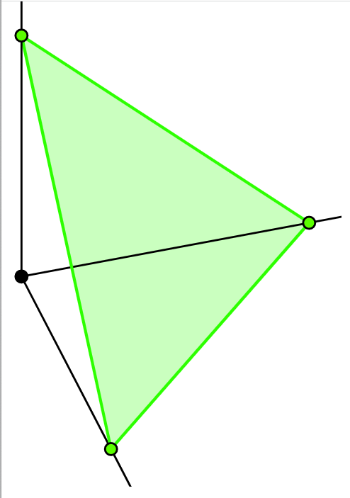
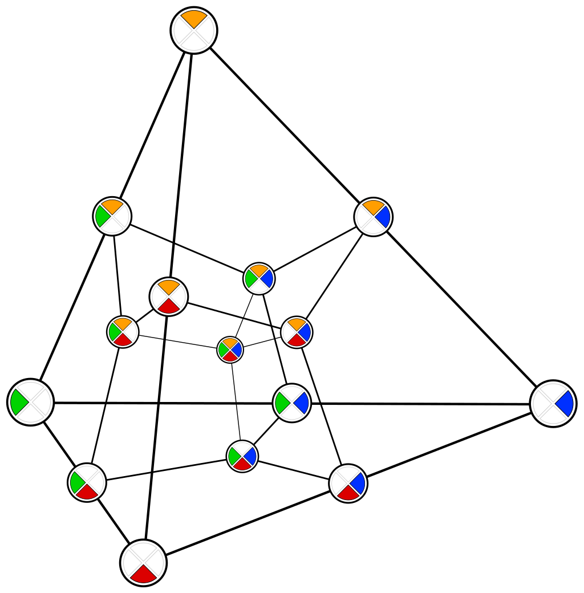

```{r setup, echo=FALSE}
library(knitr)
library(dplyr)
library(ggplot2)
opts_chunk$set(echo = FALSE, message = FALSE, warning = FALSE, cache = TRUE, dpi = 200, fig.width = 6, fig.height = 2.8, dev = 'svg', dev.args = list(bg = "transparent"))
theme424 <- theme_minimal() + 
  theme(
    panel.grid.minor = element_blank(),
    panel.background = element_rect(fill = "#f7f7f7"),
    panel.border = element_rect(fill = NA, color = "#0c0c0c", size = 0.6),
    axis.text = element_text(size = 14),
    axis.title = element_text(size = 16),
    legend.position = "bottom"
  )
theme_set(theme424)
```

# Blocking and Mixtures in Response Surface Design

```{r, out.width = 350}
include_graphics("https://uwmadison.box.com/shared/static/hxsz37wvxcj93osymlckvep6da6ipoqy.png")
```
### Statistical Experimental Design

.large[Kris Sankaran | UW Madison | December 7, 2021]

---

### Today

* Book Sections: 11.4, 11.6
* Online Notes: Week 13 [1] and [3] (skip [2])

---

### Motivation

* In response surfaces, we may encounter nuisance variation
* While sampling for a first-order model, 
  - The operators may change
  - A batch of material might be exhausted
  - Might switch from weekend to weekday in an online shop
* How can we adapt our earlier approaches to blocking?

---

### Toy Problem: Two Factors

.pull-left[
* Imagine running a central composite design with center points
* There are 14 (= 4 factorial + 4 axial + 6 central) samples to collect, but any
one operator can only collect 7 at a time
* How should we distribute the sampling points across blocks?
  - What would be a bad way to split the points?
]

.pull-right[
```{r}
include_graphics("https://krisrs1128.github.io/stat424_f21/posts/2021-08-17-week12-4/week12-4_files/figure-html5/unnamed-chunk-5-1.png")
```
]

---

### Intuition: Two Factors

.pull-left[
* The main idea is to tie blocks together at the center points. 
* Since the runs at central points should be the same, any systematic difference
is an unwanted block effect
* Remaining points are distributed to axial and factorial points
   - This ensures each block is evenly spread across low and high settings
]

.pull-right[
```{r, fig.cap = "By tying sampling center points in both the axial and factorial blocks, it becomes possible to estimate and correct for block effects."}
include_graphics("https://uwmadison.box.com/shared/static/hxsz37wvxcj93osymlckvep6da6ipoqy.png")
```
]

---

###  More than Two Blocks

* Note that we have limited ourselves to the two-block case
* In general, we follow the same approach as blocking fractional factorial
designs, but with center points tied together
  - Higher order interactions become confounded with the block ID
  - The associated assignments tend to be distributed across the cube
  - The axial points all belong to one block
* See the code example

---

# Code Implementation

---

### Blocking a Design

The default for `ccd` blocks the axial and factorial points.

.pull-left[
```{r, echo = TRUE}
library(rsm)
codings <- list(time_coded ~ (time - 35) / 5, temp_coded ~ (temp - 150) / 5)
ccd_design <- ccd(~ time_coded + temp_coded, coding = codings)
```
]

.pull-right[
```{r, echo = TRUE}
head(ccd_design)
```
]

---

### Visualization

.pull-left[
* The figures shows a CCD with samples shaded in by block
* We recovered the original temperature and time units using `decode.data`
]

.pull-right[
```{r, echo = TRUE, fig.height = 5, fig.width = 4.5, dpi = 300, out.width = 320}
ggplot(decode.data(ccd_design)) +
  geom_jitter(aes(time, temp, col = Block)) +
  coord_fixed()
```
]

---

### More than 2 Blocks

* The `blocks` argument to `ccd` allows us to define generators to use during
block construction.
* The generators here are (ABC, CDE). This creates 5 blocks.
  - Four blocks of $2^{5 - 2}$ samples, each of which is a fractional factorial
  - One block of axial points

```{r, echo = TRUE}
codings <- list(time_ ~ (time - 35) / 5, temp_ ~ (temp - 150) / 5, 
                power_ ~ power, rate_ ~ rate, cooling_ ~ cooling)
blocked_ccd <- ccd(
  ~ time_ + temp_ + power_ + rate_ + cooling_, 
  coding = codings, 
  blocks = Block ~ c(time_ * temp_ * power_, power_ * rate_ * cooling_)
)
```

---


.pull-left[
```{r}
decode.data(blocked_ccd) %>%
  arrange(time, temp) %>%
  select(time, temp, power, Block)
```
]

.pull-right[
```{r, echo = TRUE, fig.height = 5, fig.width = 4.5, dpi = 300, out.width = 320}
ggplot(decode.data(blocked_ccd)) +
  geom_jitter(aes(time, temp, col = Block), width = 0.45, height = 0.45) +
  coord_fixed()
```
]

---

### Discussion

Imagine an experiment with 6 factors. Is it possible to design a CCD that can be
split into 9 blocks? If so, describe the construction. What about 4 blocks?
Justify your answer.

---

# Mixture Experiments

---

### Motivation

* In many problems, we want to find an optimal mixture of ingredients
  - What proportion of the synthetic material should come from different
  sources?
  - How much of the computational budget should be allocated to different
  hyperparameter searches?
* Mixture experiments have a specific geometry which is different from those for
response surfaces so far
  - All the parts have to sum up to 1

---
### Simplex Geometry

* $P$: Total number of ingredients
* $x_{p}$: The fraction of ingredient $p$

Then we have the constraints,

* Data are proportions: $x_{p} \in \left[0, 1\right]$
* Sum to One: $\sum_{p = 1}^{P} x_{p} = 1$

---

### Simplex Geometry

.pull-left[
* The set of $x = \left(x_{1}, \dots, x_{P}\right)$ satisfying these constraints
is called the simplex,
  * Center point has an equal amount of each ingredient
  * Corners have 100% coming from one of the ingredients
* Factorial and central composite designs can't be used -- they might fall off
the edges
]

.pull-right[
```{r, out.width = 350}

```
]

---

### Simplex Geometry

.pull-left[
* The set of $x = \left(x_{1}, \dots, x_{P}\right)$ satisfying these constraints
is called the simplex,
  * Center point has an equal amount of each ingredient
  * Corners have 100% coming from one of the ingredients
* Factorial and central composite designs can't be used -- they might fall off
the edges
]

.pull-right[
```{r, out.width = 350}

```
]


---

### Simplex Lattice Design

.pull-left[
* Draw a grid with spacing $\frac{1}{m}$ in each direction in $p$-dimensional
space
* Discard all points that don't lie on the simplex
* The parameter $m$ controls the granularity of the sampling points.
]

.pull-right[
```{r, fig.cap = "An SLD with m = 3." , fig.height = 4, fig.width = 4}
library(mixexp)
DesignPoints(SLD(3, 3))
```
]

---

### Simplex Lattice Design

.pull-left[
Equivalently, consider integers $k_{p} \in \{0,1, \dots, m\}$ such that $\sum_{p = 1}^{P} k_{p} = m$. The $\text{SLD}\left(m\right)$ design places samples at,
\begin{align*}
\frac{1}{m}\left(k_{1}, \dots, k_{P}\right)
\end{align*}
The parameter $m$ controls the granularity of the sampling points.
]

.pull-right[
```{r, fig.cap = "An SLD with m = 5.", fig.height = 4, fig.width = 4}
DesignPoints(SLD(3, 5))
```
]

---

### Simplex Centroid Design

.pull-left[
* Corners: Permutations of the vector $\left(1, 0, \dots, 0\right)$.
* Edge midpoints: Add permutations of $\left(\frac{1}{2}, \frac{1}{2}, 0, \dots, 0\right)$.
* Face centroids: Add permutations of $\left(\frac{1}{3}, \frac{1}{3}, \frac{1}{3}, 0, \dots, 0\right)$.
* .. continue the pattern until meet sample size limit
]
	
.pull-right[
```{r, fig.height = 4, fig.width = 4}
DesignPoints(SCD(3))
```
]

---

### Fitting Surfaces

.pull-left[
Once we have samples along the simplex, we can use our earlier methods for
estimating a response surface on it
  * Can still fit polynomial or spline regression
]

.pull-right[
```{r, fig.height = 5, fig.width = 5, out.width = 700}
library(readr)
yarn <- read_csv("https://uwmadison.box.com/shared/static/jghwbsnn6qjpwdr1lc97p9mbxk8qkwif.csv")
fit <- lm(elongation ~ -1 + (x1 + x2 + x3) ^ 2, data = yarn)
ModelPlot(
  fit, 
  dimensions = list(x1 = "x1", x2 = "x2", x3 = "x3"), 
  contour = TRUE
)
```
]

---

```{r}
opts_chunk$set(echo = TRUE)
```

# Code Implementation

---

### Simplex Designs

.pull-left[
* We can use the `mixexp` package to find points along lattice and centroid
designs
* The `DesignPoints` function visualizes the resulting designs
]

.pull-right[
```{r, echo = TRUE}
library(mixexp)
head(SLD(3, 3)) # K, m
head(SCD(3)) # K
```
]

---

### Simplex Designs

.pull-left[
* We can use the `mixexp` package to find points along lattice and centroid
designs
* The `DesignPoints` function visualizes the resulting designs
]

.pull-right[
```{r, echo = TRUE, fig.height = 4, fig.width = 4}
DesignPoints(SLD(3, 3))
```
]

---

### Simplex Designs

.pull-left[
* We can use the `mixexp` package to find points along lattice and centroid
designs
* The `DesignPoints` function visualizes the resulting designs
]

.pull-right[
```{r, echo = TRUE, fig.width = 4, fig.height = 4}
DesignPoints(SCD(3))
```
]

---

### Dataset

In the yarn dataset, an experiment used an $\text{SLD}\left(3, 2\right)$ design
to measure variation in yarn elongation as a function of the fractions of
materials used to make the base fiber.

```{r, echo = TRUE}
library(readr)
yarn <- read_csv("https://uwmadison.box.com/shared/static/jghwbsnn6qjpwdr1lc97p9mbxk8qkwif.csv")
head(yarn)
```

---

### Model Fitting

* The code below fits a quadratic model with second order interactions over the
simplex.
* We omit the intercept term using `-1`
  - An intercept column would introduce a collinearity (mixture columns sum to
  1)

```{r, echo = TRUE}
fit <- lm(elongation ~ -1 + (x1 + x2 + x3) ^ 2, data = yarn)
summary(fit)
```

---

### Visualization

.pull-left[
* `ModelPlot` function shows the response surface over mixture components.
* We can change the `dimensions` argument whenever there are more than 3 mixture
components
]

.pull-right[
```{r, echo = TRUE, fig.margin = FALSE, fig.width = 5, fig.height = 5, out.width = 320}
ModelPlot(
  fit, 
  dimensions = list(x1 = "x1", x2 = "x2", x3 = "x3"), 
  contour = TRUE
)
```
]

---

### Exercise

This exercise walks through Problem 11.25.

Myers, Montgomery and Anderson-Cook (2009) describe a gasoline blending
experiment involving three mixture components. There are no constraints on the
mixture proportions, and the 10 run design
[here](https://uwmadison.box.com/shared/static/86psbganmd8qlhv5808ein0f87xr0b3u.csv)
is used.

(1)	What type of design did the experimenters use?
(2) Fit a quadratic mixture model to the data. Is this model adequate?

---

### Solution (1)

First, we read in the data.

```{r, echo = TRUE}
library(readr)
library(dplyr)
library(mixexp)
experiment <- read_csv("https://uwmadison.box.com/shared/static/86psbganmd8qlhv5808ein0f87xr0b3u.csv")
head(experiment)
```

---

### Solution (1)

.pull-left[
An $\text{SLD}(3)$ design was used. The first six rows take samples at corners
of the simplex, the next three are on the midpoints of edges, etc.
]

.pull-right[
```{r, echo = TRUE}
experiment
```
]

---

### Solution (2)

We first fit a quadratic model like in the code example above.

```{r, echo = TRUE, fig.margin = FALSE, fig.width = 5, fig.height = 5, out.width = 260}
fit <- lm(y ~ -1 + (x1 + x2 + x3) ^ 2, data = experiment)
ModelPlot(
  fit, 
  dimensions = list(x1 = "x1", x2 = "x2", x3 = "x3"), 
  contour = TRUE
)
```


---

### Solution (2)

It seems that curvature might not be necessary -- the contours are nearly
parallel. We can fit the same model without the quadratic term. The result is
simpler to interpret and provides almost the same predictions across the
simplex.

```{r, echo = TRUE, fig.margin = FALSE, fig.width = 5, fig.height = 5, out.width = 300}
fit <- lm(y ~ -1 + x1 + x2 + x3, data = experiment)
```

---

### Solution (2)

```{r, echo = TRUE, fig.margin = FALSE, fig.width = 5, fig.height = 5, out.width = 330}
ModelPlot(
  fit, 
  dimensions = list(x1 = "x1", x2 = "x2", x3 = "x3"), 
  contour = TRUE
)
```