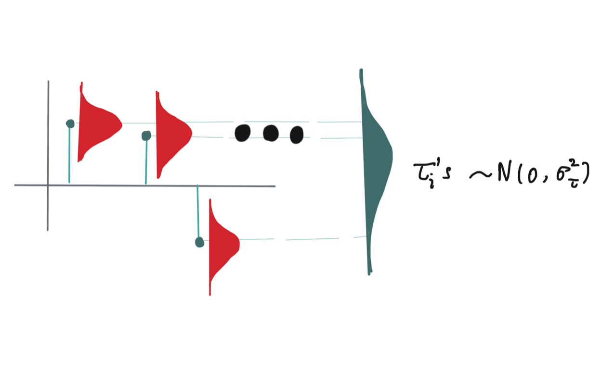
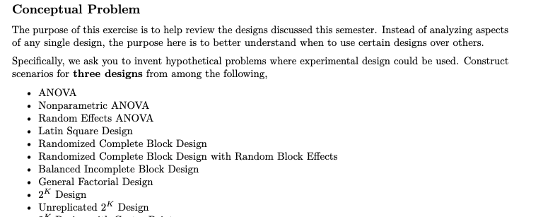
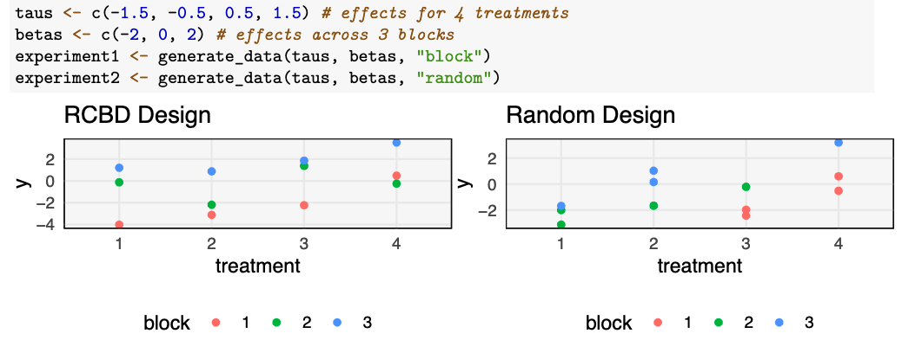
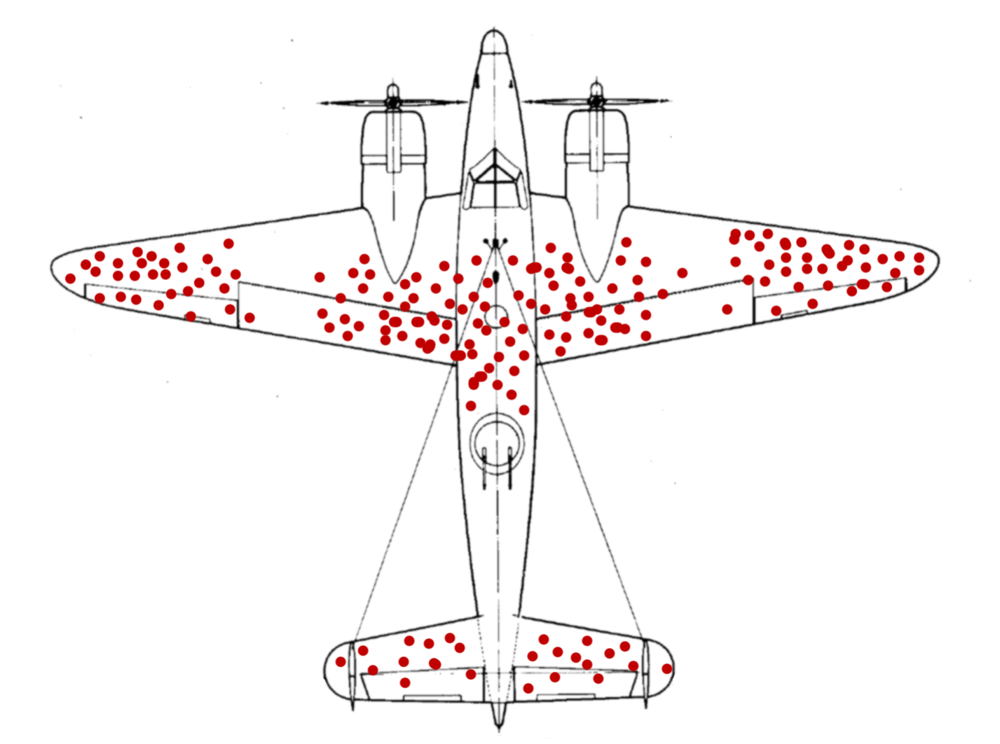
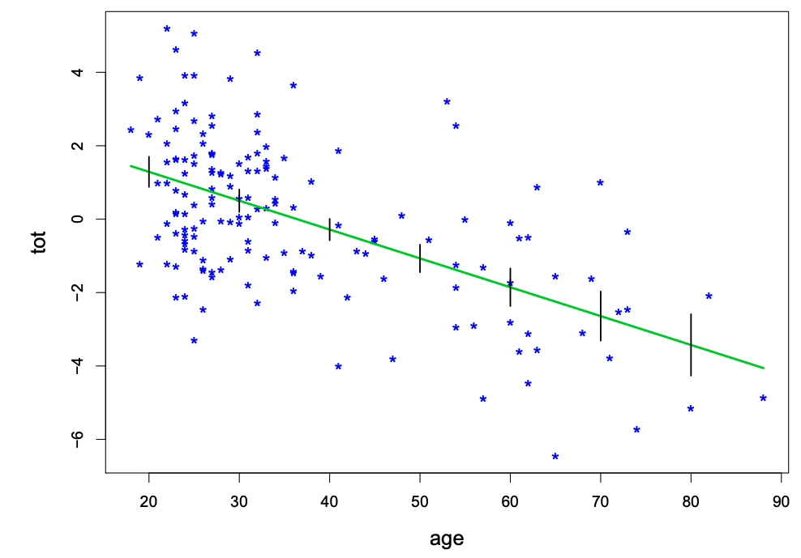
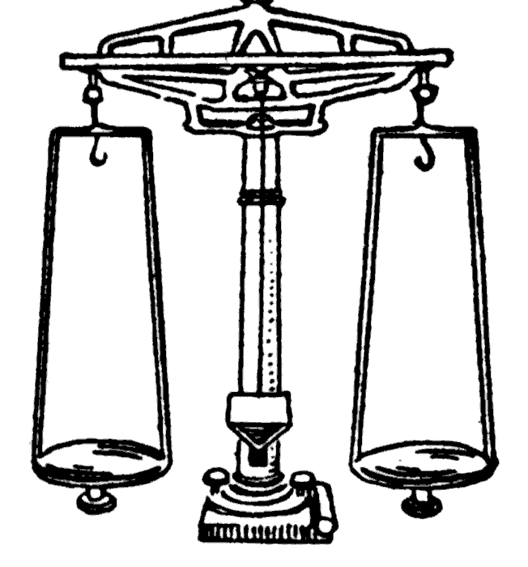
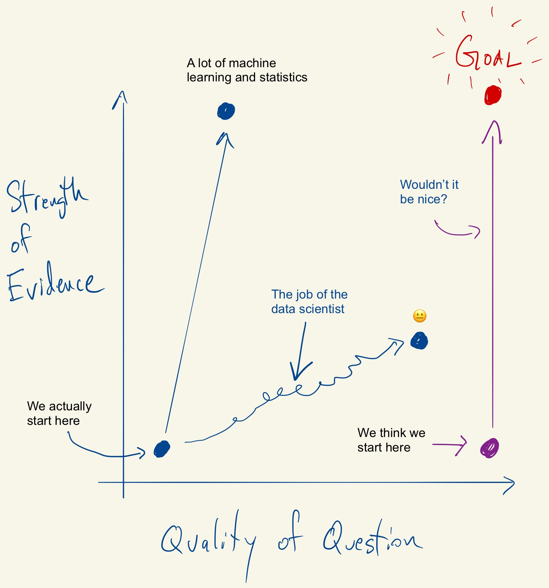

```{r setup, include=FALSE}
library(knitr)
library(ggplot2)
opts_chunk$set(echo = FALSE, message = FALSE, warning = FALSE, cache = TRUE, dpi = 200, fig.width = 2, fig.height = 1, dev = 'svg', dev.args = list(bg = "transparent"))
theme424 <- theme_minimal() + 
  theme(
    panel.grid.minor = element_blank(),
    panel.background = element_rect(fill = "#f7f7f7"),
    panel.border = element_rect(fill = NA, color = "#0c0c0c", size = 0.6),
    axis.text = element_text(size = 14),
    axis.title = element_text(size = 16),
    legend.position = "bottom"
  )
theme_set(theme424)
```

# Conclusion

```{r, out.width = 200}
include_graphics("https://uwmadison.box.com/shared/static/a8jqduhcmjzj9re22a81236k3enbtzzn.png")
```
### Statistical Experimental Design

.large[Kris Sankaran | UW Madison | December 14, 2021]

---

### Final Exam Logistics

* December 20, 12:25 - 2:25pm
* Not in this room! Held in Engineering Hall 3418

---

### Today

* No material for exam
* Some thoughts on learning and practicing statistics

---

### Learning Strategies

I hope some of the learning strategies we've used in this course help you in
your future studies.

* Complex notation can often be summarized by pictures
* Concrete examples are useful reference points
* Simulation experiments can help deepen understanding
* Being able to implement a method, however simple, is worth much more than just
knowing about a method, however sophisticated

---

### Learning Strategies

I hope some of the learning strategies we've used in this course help you in
your future studies.

*Complex notation can often be summarized by pictures*

```{r, out.width = 500}

```

---

### Learning Strategies

I hope some of the learning strategies we've used in this course help you in
your future studies.

**Concrete examples are useful reference points**

```{r, out.width = 640}

```

---

### Learning Strategies

I hope some of the learning strategies we've used in this course help you in
your future studies.

**Simulation experiments can help deepen understanding**

```{r, out.width = 600}

```


---

### Learning Strategies

I hope some of the learning strategies we've used in this course help you in
your future studies.

**Being able to implement a method, however simple, is worth much more than just knowing about a method, however sophisticated**

---

### In this course...

* We've emphasized data visualization
  - For understanding the raw data
  - Also for model checking
* We tried to interpret everything in context
  - What does each effect mean in terms of the system being studied?
* Often, the analysis results are not so clear cut
  - E.g., mildly suspicious Q-Q plots

---


# Some History

---

### 7 Rules for Experimental Design

.pull-left[
In year 1220, the Persian scientist Avicenna wrote the to understand disease, it
was important "to study one possible cause of a disease at a time."
* Realized the danger of confounding
]

.pull-right[
```{r, out.width = 300}

```

]

---


### ANOVA and Agriculture

* The first application of ANOVA was to agricultural field trials (~ 1920)
* Possible to modify multiple factors and still draw conclusions
* Blocking needed because of field-to-field variation

```{r, out.width = 600}
include_graphics("https://www.doriane.com/medias/article/anova-agronomy-reliability-design.jpg")
```

---

### Sequential Design and Industrial Processes

* First application of response surfaces was to industrial and manufacturing
processes (~ 1960)
* Optimization needed to find ideal operating conditions
* Unlike agriculture, could gather samples in rapid succession
  - Led to sequential view
  
.pull-right[
```{r, out.width = 350}
include_graphics("https://www.classiccarstodayonline.com/wp-content/uploads/2013/03/a-196X-MGB-assembly-line-b.jpg")
```
]

---

### Randomization and Online Networks

* A social network wants to see whether special notifications encourage people to send messages to their friends
* Two groups: Those who see the notification (treatment) and those who don't (control)
  - But what if someone in treatment messages someone in control?
  - Both have increased messaging activity

---

### Randomization and Online Networks

One solution is to assign treatment / control to separate subnetworks, but this
problem is still being studied.

```{r, out.width = 450}
include_graphics("cluster-randomize.png")
```

---

### Reflection

* Experimental design techniques are shaped by the context within which they were developed
* Constraints that were true in the past may no longer hold
* Carefully examining problem structure can lead to improved methods

---

### Story

.pull-left[
* During World War II, a team of statisticians was asked about where to put
armor on airplanes.
* They were given data about where bullet holes were found on returning aircraft

Where should they put the armor?
]

```{r, out.width = 500}

```

---

## Why ever analyze data?

---

### Answer 1: Combining weak evidence

* Statistics combines evidence across many sources (samples) that at first only
seem weakly related to one another
* It provides an alternative to anecdote

```{r, out.width = 400}

```
  
---

### Hotelling's Weighing Experiment

You want to weigh 8 objects and have an old-fashioned balance. How to weigh them?

* Option 1: Weigh them one after the other.
* Option 2: Weigh them in groups.

```{r, out.width = 250}

```

---

Let's simulate Option 1. There is some noise in the precision of the scale.

```{r}
options(width = 400)
```

```{r, echo = TRUE}
n <- 8
truth <- 1:n
measured <- truth + rnorm(n, 0.5)
measured
```

---

This is a summary of how far off we would be if we used these direct
measurements.

```{r, echo = TRUE}
mean((truth - measured) ^ 2)
```

---

Let's consider approach (2), which weights combinations. Each row below is a
different weighing pattern (again, we use 8 weighings).

```{r}
library(survey)
weightings <- 2 * hadamard(6) - 1
weightings
```

---

We make an estimate assuming the scale has the same noise level.

```{r, echo = TRUE}
measured <- truth %*% weightings + rnorm(n, 0.5)
estimate <- measured %*% t(weightings) / n
estimate
```

---

```{r, echo = TRUE}
mean((truth - estimate) ^ 2)
```

This estimate is much closer. 

_Lesson: Sharing evidence can improve inference._

---

### Answer 2: Better questions

.pull-left[
* Good data analysis sparks the formulation of better questions
  - Finding an "answer" is secondary
* Sharper questions helps inform decisions, either by adding to our body of
beliefs or bringing uncertainties into focus
]

.pull-right[
```{r, out.width = 390}

```
]

---

### Courses

* Statistics 609 + 610: Introduction to Statistical Inference
* Statistics 849 + 850: Theory and Application of Regression and Analysis of Variance

---

### Readings

* Wu, CF Jeff, and Michael S. Hamada. Experiments: planning, analysis, and optimization. Vol. 552. John Wiley & Sons, 2011.
* Yandell, Brian S. Practical data analysis for designed experiments. Routledge, 2017. 
* Holmes, Susan and Wolfgang Huber. Modern statistics for modern biology. Cambridge University Press, 2018.

---
class: small

### Other Readings

**Genomics / Medicine**

* Glass, David J. Experimental design for biologists. No. QH323. 5 G52. Cold Spring Harbour, NY, USA: Cold Spring Harbor Laboratory Press, 2014.
* Bartroff, Jay, Tze Leung Lai, and Mei-Chiung Shih. Sequential experimentation in clinical trials: design and analysis. Vol. 298. Springer Science & Business Media, 2012.
* Mathé, Ewy, and Sean Davis, eds. Statistical genomics: methods and protocols. Humana Press, 2016.
* Fleiss, Joseph L. Design and analysis of clinical experiments. Vol. 73. John Wiley & Sons, 2011.

**Internet**
* Kohavi, Ron, Diane Tang, and Ya Xu. Trustworthy online controlled experiments: A practical guide to a/b testing. Cambridge University Press, 2020.
* Diamantopoulos, Nikos, et al. "Engineering for a science-centric experimentation platform." Proceedings of the ACM/IEEE 42nd International Conference on Software Engineering: Software Engineering in Practice. 2020.
