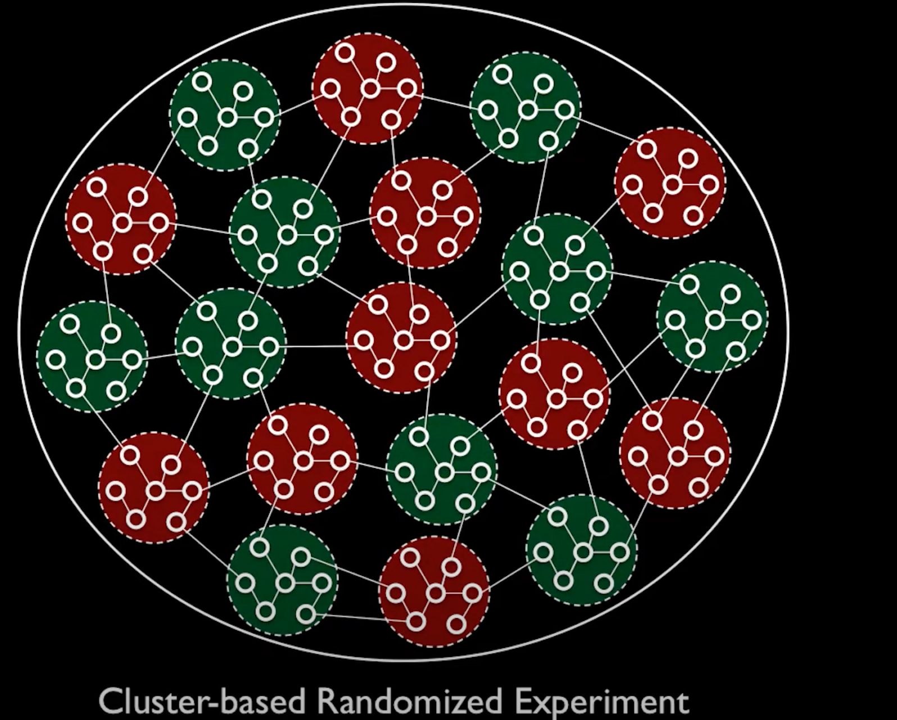

```{r setup, include=FALSE}
library(knitr)
library(ggplot2)
opts_chunk$set(echo = FALSE, message = FALSE, warning = FALSE, cache = TRUE, dpi = 200, fig.width = 2, fig.height = 1, dev = 'svg', dev.args = list(bg = "transparent"))
theme424 <- theme_minimal() + 
  theme(
    panel.grid.minor = element_blank(),
    panel.background = element_rect(fill = "#f7f7f7"),
    panel.border = element_rect(fill = NA, color = "#0c0c0c", size = 0.6),
    axis.text = element_text(size = 14),
    axis.title = element_text(size = 16),
    legend.position = "bottom"
  )
theme_set(theme424)
```

# Final Notes

```{r, out.width = 200}
include_graphics("https://uwmadison.box.com/shared/static/a8jqduhcmjzj9re22a81236k3enbtzzn.png")
```
### Statistical Experimental Design

.large[Kris Sankaran | UW Madison ]

---

### Learning Strategies

I hope some of the learning strategies we've used in this course help you in
your future studies.

* Complex notation can often be summarized by pictures
* Concrete examples are useful reference points
* Simulation experiments can help deepen understanding
* Being able to implement a method, however simple, is worth much more than just
knowing about a method, however sophisticated

---

### Today

* No technical material
* Some thoughts on practical statistics

---

# Problem Discovery

---

### Story 1

* During World War II, a team of statisticians was asked about where to put
armor on airplanes.
* They were given data about where bullet holes were found on returning aircraft

Where should they put the armor?

---

### Story 1

* During World War II, a team of statisticians was asked about where to put
armor on airplanes.
* They were given data about where bullet holes were found on returning aircraft

Where should they put the armor?

Wherever bullet holes were not found...

---

### Reflection

* It's critical to know where the data came from
  - Almost every practicing statistician will have stories
* The problem that's easiest to solve might not be the one that's most relevant

---

# Explore Problem Structure

---

### ANOVA and Agriculture

* The first application of ANOVA was to agricultural field trials (~ 1920)
* Which variety of crops provide the most yield?
* Blocking needed because of field-to-field variation

```{r}
include_graphics("https://www.doriane.com/medias/article/anova-agronomy-reliability-design.jpg")
```

---

### Sequential Design and Industrial Processes

* First application of response surfaces was to industrial and manufacturing
processes (~ 1960)
* Optimization needed to find ideal operating conditions
* Unlike agriculture, could gather samples in rapid succession
  - Led to sequential view
  
.pull-right[
```{r}
include_graphics("https://www.classiccarstodayonline.com/wp-content/uploads/2013/03/a-196X-MGB-assembly-line-b.jpg")
```

]

---

### Randomization and Online Networks

* A social network wants to see whether special notifications encourage people to send messages to their friends
* Two groups: Those who see the notification (treatment) and those who don't (control)
  - But what if someone in treatment messages someone in control?
  - Both have increased messaging activity

---

### Randomization and Online Networks

One solution is to assign treatment / control to separate subnetworks, but this
problem is still open

```{r}

```

---

### Reflection

* The methods we use in statistics are shaped by the context within which they were developed
* Constraints that were true in the past may no longer hold
* Carefully examining problem structure can lead to improved methods

---

# Asking Better Questions

---

### Why analyze data?

* Good data analysis sparks the formulation of better questions
  - Finding an "answer" is secondary
* Sharper questions helps inform decisions, either by adding to our body of
beliefs or bringing uncertainties into focus

.pull-right[
```{r}
include_graphics("https://simplystatistics.org/post/2019-04-17-tukey-design-thinking-and-better-questions_files/question_evidence.png")
```
]