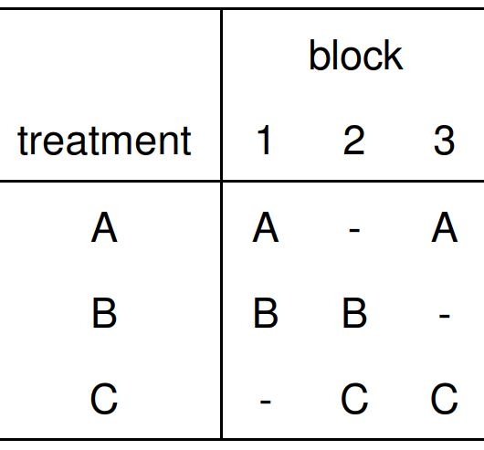

```{r setup, include=FALSE}
library(knitr)
library(ggplot2)
opts_chunk$set(echo = FALSE, message = FALSE, warning = FALSE, cache = TRUE, dpi = 200, fig.width = 2, fig.height = 1, dev = 'svg', dev.args = list(bg = "transparent"))
theme424 <- theme_minimal() + 
  theme(
    panel.grid.minor = element_blank(),
    panel.background = element_rect(fill = "#f7f7f7"),
    panel.border = element_rect(fill = NA, color = "#0c0c0c", size = 0.6),
    axis.text = element_text(size = 14),
    axis.title = element_text(size = 16),
    legend.position = "bottom"
  )
theme_set(theme424)
```

# Introduction to Balanced Incomplete Block Designs

```{r, out.width = 200}
```
### Statistical Experimental Design

.large[Kris Sankaran | UW Madison | October 2021]

---

### Today

* Book Sections: 4.4
* Online Notes: Week 6 [1]

---

### Motivation

* Randomized Complete Block Designs are useful for controlling nuisance variation
* What if we have a limit on the total number of samples available in each block?
  - All the material in the batch might get used up
  - Any individual might only have time to collect a few samples
* We need an alternative that handles this case

---

### Incomplete Designs

* In an incomplete design, not all treatments appear in each block
* A design is **balanced** if any pair of treatments appear together in a block the same number of times
* Balance ensures that treatment and block effects don't become confounded

.pull-right[
```{r, fig.show = "hold", out.width = 200, fig.cap = "An example BIBD with 3 treatments total and 2 treatments run per each block."}

```
]

---

### Incomplete Designs

* In an incomplete design, not all treatments appear in each block
* A design is **balanced** if any pair of treatments appear together in a block the same number of times
* Balance ensures that treatment and block effects don't become confounded

.pull-right[
```{r, fig.show = "hold", out.width = 250, fig.cap = "An example BIBD with 4 treatments total and 2 treatments run per each block."}

```
]

---

### Notation

We will need a bit of notation to keep track of all the parameters in this design,

* $a$: Number of treatment levels
* $b$: Number of blocks
* $k$: Number of treatments per block
* $r$: Number of blocks per treatment
* $\lambda$: Number of appearances for each level pair

```{r, fig.cap = "Circles mark which treatments are run in which blocks. We need to ensure balance across this diagram.", out.width = 500}

```

---

### Constraint

* It's generally not possible to find a design for arbitrary values of these
parameters
* The main constraint is $\lambda (a - 1) = r(k - 1)$
  - A counting-based proof is given in the notes
  - Later, we will use a package to determine possible configurations

```{r, fig.cap = "Circles mark which treatments are run in which blocks. We need to ensure balance across this diagram.", out.width = 500}

```

---

### Discussion

For one example we showed above, what are the values of $a, b, k$, $r$, and
$\lambda$?

```{r, fig.show = "hold", out.width = 200, fig.cap = "An example BIBD with 3 treatments total and 2 treatments run per each block."}


```

---

### Model

The model is the same as in the RCBD,
\begin{align}
y_{ij} &= \mu + \tau_i + \beta_j + \epsilon_{ij} \\
\epsilon_{ij} &\sim \mathcal{N}\left(0, \sigma^2\right)
\end{align}

The difference is that $y_{ij}$ isn't observed for all combinations of blocks and treatments.

---

### Hypothesis Testing

We are generally interested in whether any treatment is different from the rest,

\begin{aligned}
H_0 &: \tau_1 = \dots = \tau_a = 0 \\
H_{1} &: \tau_{i} \neq 0 \text{ for at least one } i
\end{aligned}

---

### ANOVA-like Identity

As in previous designs, we will use a decomposition of the total sum of squares
to come up with a hypothesis test,

$$
SS_{\text{Total}} = SS_{\text{Treatments}\left(adjusted\right)} + SS_{\text{Block}} + SS_{E}
$$

---

### Interpretation

The $SS_{\text{Total}}$ and $SS_{\text{Block}}$ terms are familiar, except
they are only summed over terms that are observed,
\begin{align}
SS_{\text{Total}} &= \sum_{i, j} \left(y_{ij} - \bar{y}_{\cdot\cdot}\right)^2 \\
SS_{\text{Block}} &= k \sum_{j} \left(\bar{y}_{\cdot j} - \bar{y}_{\cdot\cdot}\right)^2
\end{align}

---

### Interpretation

But $SS_{\text{Treatments}}$ has to be adjusted. The reason is each treatment
only appears in a subset of blocks, which might bias conclusions.

    \begin{align*}
    SS_{\text{Treatments }(adjusted )}=\frac{k}{\lambda a} \sum_{i=1}^{a}\left(\bar{y}_{i}-\frac{1}{k} \sum_{j \in B(j)} \bar{y}_{\cdot j}\right)^2
    \end{align*}
    where $B\left(j\right)$ indexes the blocks within which treatment $i$ was administered.

```{r}

```

---

### Test Statistic

Given this decomposition, we can compute the reference distribution of the usual
Treatment vs. Random Error mean squares ratio,

\begin{aligned}
\frac{M S_{\text {Treatment }(\text { adjusted })}}{M S_{E}} &:=\frac{\frac{1}{a-1} S S_{\text {Treatment }(\text { adjusted })}}{\frac{1}{N-a-b+1} S S_{E}} \\
& \sim F(a-1, N-a-b+1)
\end{aligned}

and this becomes the basis for a hypothesis test.

---

# Code Implementation

```{r}
opts_chunk$set(echo = TRUE)
```


---

### Navigating Constraints

* We can use `BIBsize` to determine the minimum number of blocks that must be
sampled before a balanced design can be constructed.
* We imagine having 5 treatments of interest, but can only run 3 in each block.

```{r}
library(daewr)
BIBsize(t = 5, k = 3) # we should use 10 blocks
```

---

### Constructing a Design

Given a specific configuration of parameters $a, b, k$, we can find an
assignment of treatments to each block using the `find.BIB` function.

```{r}
find.BIB(trt = 5, k = 3, b = 10)
```

---

### Catalyst Dataset

We illustrate BIBD analysis using the `catalyst` experiment, which studied the
effect of different catalysts on chemical reaction time.

```{r}
library(readr)
library(dplyr)
catalyst <- read_table2("https://uwmadison.box.com/shared/static/2tfwo6oohyffw0x299105rj54iabkw4u.txt") %>%
  mutate_at(vars(-Time), as.factor) # use as.factor on all but the Time column
```

---

### Plot

There seem to be definitive batch effects, but it's unclear whether there's any
difference between Catalysts.

Q: How can we tell from the figure that this is an incomplete design?

```{r}
library(ggplot2)
library(ggbeeswarm)
ggplot(catalyst) +
  geom_beeswarm(aes(x = Batch, y = Time, col = Catalyst)) +
  scale_color_brewer(palette = "Set2")
```

---

### Hypothesis Testing

Our $F$-statistic suggests that the catalysts do have systematic (though
relatively weak) differences.

```{r}
fit <- lm(Time ~ ., data = catalyst)
aov_table <- aov(fit)
summary(aov_table) # only the unadjusted block mean square
```

---

### Multiple Testing

* Contrasts can be done in exactly the same was as done before
* Multiple comparisons in the BIBD setup requires a different package, `lsmeans`,

```{r}
library(lsmeans)
lsmeans(fit, pairwise ~ Catalyst, adjust = "Tukey") # tukey's test
```

---

### Exercise

This exercise walks through problem 4.44.

.pull-left[
Seven different hardwood concentrations are being studied to determine their
effect on the strength of the paper produced. However, the pilot plant can only
produce three runs each day. As days may differ, the analyst uses the BIBD that
follows. Analyze the data from this experiment (use $\alpha = 0.05$) and draw
conclusions.
]

.pull-right[
```{r}
experiment <- data.frame(
  concentration = c(2, 4, 8, 4, 6, 10, 6, 8, 12, 8, 10, 14, 2, 10, 12, 4, 12, 14, 2, 6, 14),
  days = rep(1:7, each = 3),
  strength = c(114, 126, 141, 120, 137, 145, 117, 129, 120, 149, 150, 136, 120, 143, 118, 119, 123, 130, 117, 134, 127)
)
```
]

---

### Exercise

(1) Map the qualitative problem onto the formal notation of BIBDs. What is the
interpretation of $\tau_i$ and $\beta_j$ in this context?

(2) Use `lm` and `aov` to conduct a test of the differences across concentration
levels, controlling for possible day effects.

(3) Interpret the results of the test in (2) within the original problem
context.

---

### Solution - (1)

* The nuisance variation comes from days, therefore the blocking parameters
$\beta_{j}$ correspond to offsets for each day of the week.
* The variation of interest is the variation across hardwood concentration
levels. These correspond to $\tau_i$'s.

---

### Solution (2)

```{r}
fit <- lm(strength ~ days + concentration, data = experiment)
summary(aov(fit))
```

---

### Solution (3)

At the $\alpha = 0.05$ level, there is no detectable relationship between
hardwood concentration and paper strength, after controlling for day-to-day
variation in the mill.