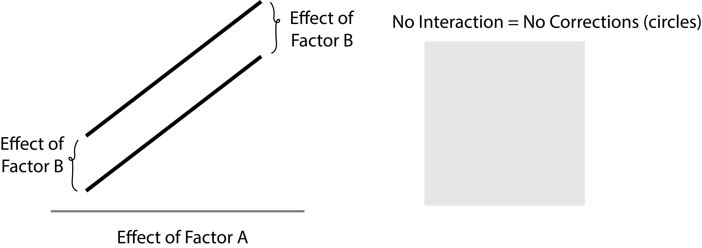
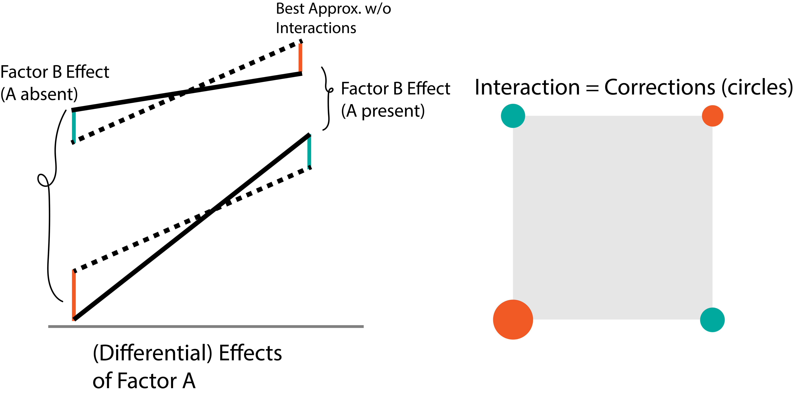

```{r echo=FALSE}
library(knitr)
library(ggplot2)
opts_chunk$set(echo = FALSE, message = FALSE, warning = FALSE, cache = FALSE, dpi = 200, fig.width = 6, fig.height = 2.8, dev = 'svg', dev.args = list(bg = "transparent"))
theme424 <- theme_minimal() + 
  theme(
    panel.grid.minor = element_blank(),
    panel.background = element_rect(fill = "#f7f7f7"),
    panel.border = element_rect(fill = NA, color = "#0c0c0c", size = 0.6),
    axis.text = element_text(size = 14),
    axis.title = element_text(size = 16),
    legend.position = "bottom"
  )
theme_set(theme424)
```

# $2^2$ Factorial Designs in Depth

```{r, out.width = 300}
include_graphics("https://uwmadison.box.com/shared/static/32pelq6o9jz7nnnavkdx1kjuxfjkvzrc.png")
```

### Statistical Experimental Design

.large[Kris Sankaran | UW Madison | 26 October 2021]

---

### Discussion Follow-up (I)

* In the examples, why were we only using 2 levels per factor? 
  - This is mainly for visual convenience (and to give a head start for the next sections)
  - We will see that there is much more that can be said about the 2-level special case
* Which method should we use when?
  - The _motivation_ slide in past lectures should help
  - We'll try including slides about this in future lectures
* Where are we going, overall?
  - $2^K$ designs, $2^K$ designs with very large $K$ (fractional factorials),
  and advanced response surfaces
  - We want richer machinery for working with many factors

---

### Discussion Follow-up (II)

There was a fair bit of confusion about interaction terms, the cube
visualization of them, and whether there was any intuitive way to think about
them.

Intuition: Interactions exist when there is a nonuniformity of effects
  - Ice cream / French Fries vs. Chocolate / Ketchup
  - Education level, political affiliation, and belief in climate change
  - Drug given to patients with different stroke severity

---

### Cube Plot

* The cube plot was necessary because we can't visualize a surface in four
dimensions.
* We can understand it through analogy with the 2D case

.pull-left-right[
```{r}
include_graphics("https://uwmadison.box.com/shared/static/gnoa5i4w5qp6ehbweh30n3a2v91qpi89.png")
```
]

---

### Cube Plot

.pull-left[
* The cube plot was necessary because we can't visualize a surface in four
dimensions.
* We can understand it through analogy with the 2D case
]

.pull-right[
```{r}
include_graphics("https://uwmadison.box.com/shared/static/gnoa5i4w5qp6ehbweh30n3a2v91qpi89.png")
```
]

---

### Cube Plot

.pull-left[
* The cube plot was necessary because we can't visualize a surface in four
dimensions.
* We can understand it through analogy with the 2D case
]

.pull-right[
```{r}

```
]

---

### Cube Plot

.pull-left[
* The cube plot was necessary because we can't visualize a surface in four
dimensions.
* We can understand it through analogy with the 2D case
]

.pull-right[
```{r}

```
]

---

### Higher-Order Interactions

* For second-order interactions (e.g., ABC), we compute "correction factors" for
the model that could use first-order interactions (e.g., AB, BC, and AC).
* Example: Suppose there were an interaction between drug efficacy (A) and
disease severity (B). The drug leads to more improvement among sicker people.
  - If the interaction effect looks identical across two age groups (C), then
  there is only a first-order interaction
  - If the shape of the interactions changes across C, then there is an ABC
  interaction
* In the future, we *will* consider models with all high-order interactions, but
we will be more skeptical about their existence

---

### Today

* Book Sections: 6.1 - 6.2
* Online Notes: Week 8 [1] and [2]

---

### Motivation

A $2^{K}$ design is a factorial design where each of the $K$ factors is tested
at only two values (high and low).

.pull-left[
* These designs are useful for screening experiments
* If the response does not change even when the factor is at its extremes, that factor likely doesn't matter
* We can study the relationship important factors and the response in a follow-up experiment
]

.pull-right[
General two factor vs. $2^{2}$ design.
```{r, out.width = 220}
include_graphics("https://uwmadison.box.com/shared/static/e6sprneaeamlav35csswq68t62p0xney.png")
include_graphics("https://uwmadison.box.com/shared/static/jst0ib619vjw386gnl2hs8pee5rkkbx1.png")
```
]

---

### Motivation

* It may be possible to vary many parameters in a manufacturing process. Which
avenues are worth pursuing in more depth?
* The transportation department would like to encourage alternatives to driving
to campus. Which particular levers are likely to influence commuters?
* When training a machine learning model, many hyperparameters might impact
performance. Which are the most important?

---

### Representations

* A $2^{2}$ design samples data at corners of a square
* We can represent corners using either `+ / -` or alphabetical notation
* We often abuse notation and write a letter to represent the *sum* of the
responses at that corner, not just its index

| A | B | label |
|---|---|---------|
| - | - | (1)     |
| + | - | a       |
| - | + | b       |
| + | + | ab      |

---

### Estimation: Main Effects

Simple formulas summarize the main and interaction effects in a $2^{2}$ design.

.pull-left[
> "What is the average change in the response when A is activated?"

\begin{align}
A &= \frac{1}{2n}\left(\left(ab +a\right) - \left(b + (1)\right)\right)
\end{align}
]

.pull-right[
```{r}
include_graphics("https://uwmadison.box.com/shared/static/32pelq6o9jz7nnnavkdx1kjuxfjkvzrc.png")
```
]

---

### Estimation: Interaction Effects

Simple formulas summarize the main and interaction effects in a $2^{2}$ design.

.pull-left[
> "Does the effect of A change depending on whether or not B is active?"

\begin{align}
AB &= \frac{1}{2n}\left[\left(ab - b\right) + \left(a - \left(1\right)\right)\right]
\end{align}
]

.pull-right[
```{r}
include_graphics("https://uwmadison.box.com/shared/static/hvedijshgaw7so91kqcl1l8eunml4m9v.png")
```
]

---

### Notational Trick

If we can remember the tabular representation, we don't need to memorize any
formulas.

|label | effect A | effect B | effect AB |
| --- |---|---|---------|
| (1) | - | - |  + |
| a | + | - | - |
| b | - | + | - |
| ab | + | + | + |

---

### Hypothesis Testing

How can we gauge if an estimated effect is significant?

* Call the numerators in the effect estimates above "contrasts"
* E.g., the contrast for A is $ab + a - b - \left(1\right)$
* The associated sum of squares has a simple form,

\begin{align*}
SS_{\text{Factor}} &= \frac{1}{2^2 n}\left(\text{Contrast(Factor)}\right)^2
\end{align*}

Q: What is the form of $SS_{A}$?

---

### ANOVA-like Identity

In the two factor case, we have the identity,

\begin{align*}
SS_{\text{Total}} = SS_A + SS_B + SS_{AB} + SS_E
\end{align*}

* The df’s for the main and interaction terms are all 1 (there are two levels for each)
* The df of $SS_T$ is $n 2^2 - 1$ (number of samples minus one)
* The df of $SS_{E}$ is $\left(n 2^2 - 1\right) - 3 = 4\left(n - 1\right)$
* $F$-statistics are formed by taking the ratios between $SS$ and $MS_E$ terms

---

### Regression Perspective

All the formulas we've shown are consistent with the effect estimates of a
regression model,

\begin{align*}
y = \beta_0 + \beta_1 x_1 + \beta_2 x_2 + \epsilon
\end{align*}

where the $x_k$’s take on one of two values.

* This model only includes main effects
* An interaction would require an extra $\beta_{12} x_{1}x_{2}$ term

---

### Coding

.pull-left[
* To use the regression approach, we need to _code_ the variables
* Coding converts low and high levels to ${-1, 1}$.
* This makes scales comparable and removes correlation between factors
]

.pull-right[
```{r}
include_graphics("https://uwmadison.box.com/shared/static/giacopxkfj5jhuucepards9fv0cqvbmc.png")
```
]

---

# Code Implementation

```{r}
opts_chunk$set(echo = TRUE)
```


---

### Yield Dataset

We will illustrate these ideas on a yield dataset. There are 12 samples total,
three replicates at each corner of the square.

```{r}
library(readr)
yield <- read_table2("https://uwmadison.box.com/shared/static/bfwd6us8xsii4uelzftg1azu2f7z77mk.txt")
head(yield, 8)
```

---

### Visualization

We can use the `facet_wrap` command to plot the effect of A when B is or is not
active. The slope changes slightly across panels, but it could be due to chance.

```{r}
ggplot(yield) +
  geom_point(aes(A, Yield)) +
  facet_wrap(~B)
```

---

### Interaction Plot

Another useful command is `interaction.plot`, which shows the same kind of
information, but in one line.

```{r, fig.width = 6, fig.height = 3.8}
interaction.plot(yield$A, yield$B, yield$Yield)
```

---

### Coding

* For testing, we can still use the `lm + aov` approach from before
* First though, we code the low and high values as -1 and 1

```{r}
library(dplyr)
coded <- function(x) ifelse(x == '-', -1, 1)
yield <- yield %>%
  mutate(cA = coded(A), cB = coded(B))
fit <- lm(Yield ~ cA * cB, data = yield)
summary(aov(fit))
```

---

### Effect Estimates

We could implement the formulas by hand, e.g., for the main effect of A,

```{r}
mean(yield$Yield[yield$cA == 1]) - mean(yield$Yield[yield$cA == -1])
```
Alternatively, we could use the coefficients of the fitted model.

```{r}
2 * coef(fit) # works for main and interaction effects
```

The fact that the effect estimates in $2^K$ designs are always `2 * coef(fit)`
will be proved next week.

---

### Top-Down Visualization

For a $2^2$ design, we can visualize the fitted regression surface from the top
down, using the `image` command from the `rsm` package.

```{r, fig.height = 3.5, fig.width = 3.5}
library(rsm)
image(fit, ~ cA + cB)
```


---

### Exercise

This walks through Exercise 6.14.

An article describes the application of two-level factorial designs to circuit
manufacturing. An experiment was run using two factors: arsenic flow rate (A)
and deposition time (B). Four replicates were run, and the epitaxial layer
thickness was measured. The data are [here](https://uwmadison.box.com/shared/static/0f3435o8no6zvvzyd0lvgbx1jzt72xcs.csv).

* Estimate the factor effects
* Conduct an analysis of variance. Which factors are important
* Write down a regression equation that could be used to predict epitaxial layer
thickness. You may use these [codings](https://uwmadison.box.com/shared/static/f78j6y6dnnxom41ge3e08n0m2wygswzq.csv).

---

(1) Read the data in from the link provided.
(2) Using `mutate_at`, code the `+` and `-` levels for each factor into -1, 1.
(3) Fit the response `yield` onto both factors, A and B.
(4) Double the fitted coefficients to estimate the factor effects.
(5) Interpret the $p$-values given by `aov` to determine the important factors.
(6) Use the estimated factor effects and the given codings to write an equation
to predict the response at new flow rates and deposition times.

---

### Solution (1) and (2)

```{r}
library(readr)
library(dplyr)
coded <- function(x) ifelse(x == '-', -1, 1)

experiment <- read_csv("https://uwmadison.box.com/shared/static/0f3435o8no6zvvzyd0lvgbx1jzt72xcs.csv") %>%
  mutate_at(vars(A, B), coded)
```

---

### Solution (3) and (4)

```{r}
fit <- lm(yield ~ A * B, experiment)
2 * coef(fit)
```

---

### Solution (5)

```{r}
summary(aov(fit))
```

None of the factors are significant at the $\alpha = 0.05$ level, though B is
significant at $\alpha = 0.1$.

---

### Solution (6)

First code the flow and time values,

\begin{align*}
\tilde{\text{flow}} &= 2\left[\frac{\text{flow} - 55}}{59 - 55}\right] - 1 \\
\tilde{\text{time}} &= 2\left[\frac{\text{time} - 10}{15 - 5}}\right] - 1
\end{align*}

(to convince yourself that the coding works, check that 55 maps to -1 and 59
maps to 1 in the first coding, for example).

---

### Solution (6)

Then substitute the fitted coefficients,

\begin{align*}
\hat{y} &= 29.0405 -1.1975\tilde{\text{flow}} + 0.609\tilde{\text{time}} \left(\right) + 1.126\tilde{\text{flow}} \tilde{\text{time}}
\end{align*}